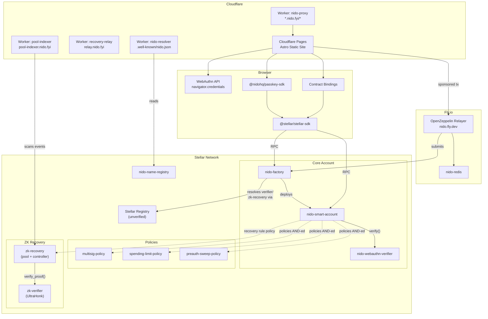
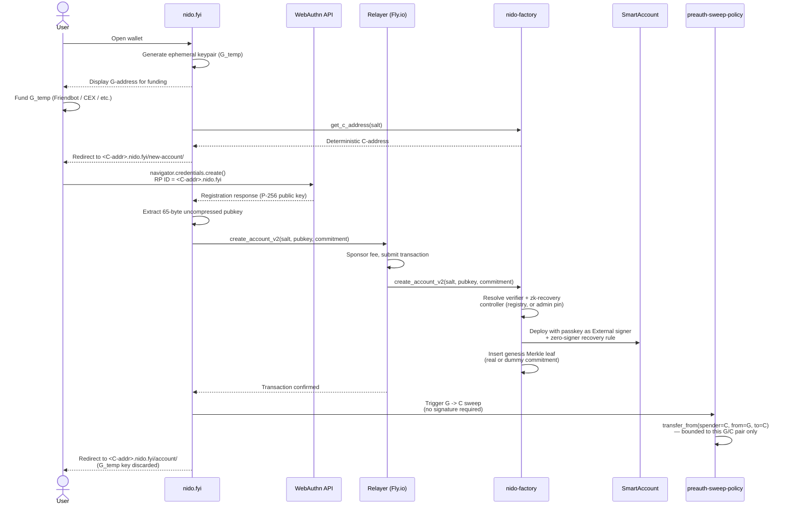
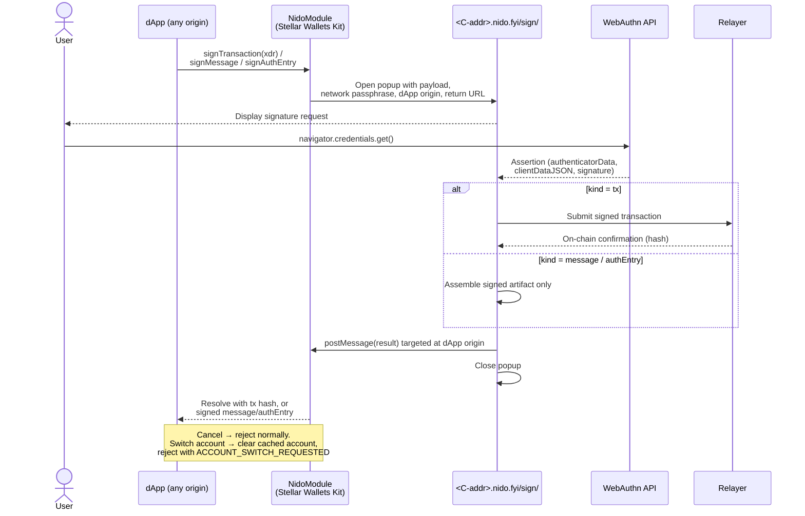
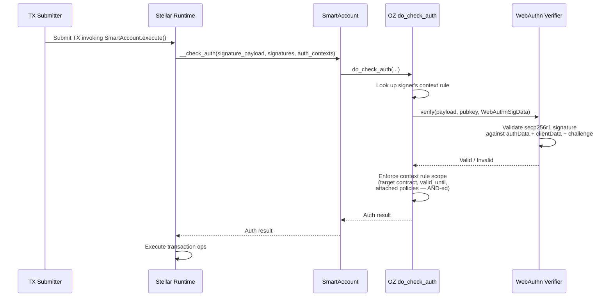

# Technical Architecture

## 1. System Overview

Nido helps users move from traditional Stellar accounts ("G-addresses") to Soroban Smart Accounts ("C-addresses") using WebAuthn/passkey authentication. The system consists of Soroban smart contracts (built on OpenZeppelin's stellar-accounts), a passkey SDK (`@nidohq/passkey-sdk`), and an Astro-based web app deployed to Cloudflare Pages with a wildcard subdomain architecture, and a relayer that sponsors transaction fees. All passkey verification happens on-chain; the relayer submits and pays for the transactions but never validates a signature itself.

### High-Level Flow
1. **Onboarding:** Wallet creates an ephemeral G-address → G-address is funded (by Friendbot on Testnet; the user funds it themselves by transferring funds from an exchange on Mainnet) → wallet reserves a randomly-salted C-address → user creates a passkey → factory deploys the smart account, with a relayer paying the deployment fee → G's balance moves into the new account and its key is discarded.

2. **Signing:** dApp redirects user to their account subdomain with a hash to sign → user approves with passkey → wallet redirects back with signature components.

## 2. Components

### A. Web App (Astro + Cloudflare)

A static Astro site deployed to Cloudflare Pages at `nido.fyi`, using a **subdomain-per-account** pattern where each Smart Account lives at `<contractId>.nido.fyi`. A Cloudflare Worker proxies wildcard subdomain requests to the main site. The frontend extracts the contract ID from the hostname.

Stellar interactions happen client-side via @stellar/stellar-sdk. The Astro app itself has no server-side API routes; when the relayer is enabled, the client calls out to that separate off-chain service (infra/relayer/) for transaction submission and fee sponsorship (see §4).

**Pages:**

| Route | Purpose |
|-------|---------|
| `/` | Nido account creation entry point: the wallet generates an ephemeral G-address keypair and automatically funds it via Friendbot (testnet-only — no user action; on mainnet, this step will instead require the user to fund it themselves, e.g. a transfer from an exchange), computes the predicted C-address via Factory.get_c_address(), and links to the deployment page. |
| `/new-account/` | Passkey registration + Smart Account deployment. Calls `navigator.credentials.create()` with P-256 (`alg: -7`), RP ID scoped to the subdomain hostname. Builds the `Factory.create_account()` transaction and submits it via the relayer, which pays the deployment fee. |
| `/account/` | Account home: balance/activity overview and entry points to sending funds, viewing/editing security settings, and naming.
| `/account/activity/` | Transaction history. |
| `/connect/` | dApp connect / account-picker screen (used by the Stellar Wallets Kit integration). |
| `/sign/` | Unified signing surface for dApp-originated transaction, message, and auth-entry requests. |
| `/transfer/` | Send any held SAC/SEP-41 asset, with a review step before the passkey ceremony. |
| `/security/` | Security hub: recovery and session-key delegation management. |
| `/security/recover/` | Account-recovery ceremony (friend-assisted M-of-N rotation, or the ZK-recovery flow). |
| `/security/delegate/` | Session-key delegation approval ("an app wants to act on your behalf"). |
| `/how-recovery-works/` |	Educational explainer for the ZK-recovery design. |
| `/status-message/` | Demo page for the example dApp integration. |
| `/nido-storage-bridge/` |	Cross-subdomain postMessage bridge that syncs local wallet state between an account's subdomain and others. |

**Subdomain isolation:** The WebAuthn RP ID is the full hostname (e.g., `CABC123.nido.fyi`), so passkeys are cryptographically scoped per-account at the DNS level. A passkey registered for one account cannot sign for another.

### B. Passkey SDK (`@nidohq/passkey-sdk`)

TypeScript SDK (`packages/passkey-sdk/`) providing WebAuthn + Soroban integration utilities. Peer dependency on `@stellar/stellar-sdk`. Published to npm as @nidohq/passkey-sdk.

| Module | Purpose |
|--------|---------|
| `webauthn.ts`, `signature.ts`, `assertionMatch.ts` | Extract the 65-byte uncompressed P-256 public key from a WebAuthn registration response, convert ASN.1 DER ECDSA signatures to Stellar's compact low-S form, and identify which registered signer produced a given assertion. |
| `auth.ts`, `multiSigner.ts`, `nestedAuth.ts` | Build Soroban authorization hashes, parse WebAuthn assertion responses, inject passkey signatures into transaction auth entries, and assemble multi-signer / nested-auth payloads for policy-gated calls. |
| `deploy.ts` | Compute deterministic C-addresses, check for existing deployments, and drive smart-account deployment flow via the Factory contract. |
| `relayer.ts` | Client for the off-chain relayer (infra/relayer/): submits a {func, auth} payload, polls for confirmation, and extracts the function/auth pair from an assembled transaction. |
| `registry.ts`, `resolve.ts` |	Resolve contract addresses (factory, verifier, zk-recovery) from the on-chain registry with hardcoded fallbacks, and resolve/cache human-readable Nido names. |
| `url.ts` | Parse/build subdomain URLs — contract ID and name extraction from a hostname, account and dApp URL construction. |
| `storage.ts` | Local credential, account, session-key, and friend-nickname persistence (localStorage-backed). |
| `sessionKey.ts`, `policyBlocks/` | Session-key material helpers and reusable policy-rule builders (scoped session keys, multisig recovery/rotation) installed on a smart account. |
| `friendSigning.ts`, `resolveFriendInput.ts` | Friend-assisted recovery signing flow: resolve a friend's name/address input and drive the handoff signing ceremony. |
| `zkRecovery/`	| ZK-recovery client: Poseidon hashing, Merkle-tree derivation and pool sync, enrollment, recovery-auth-hash construction, and proof-request orchestration against the zk-recovery pool contract and circuit. |
| `syntheticAssertion.ts` | Constructs synthetic WebAuthn assertions for tests, without a real authenticator. |

### C. Contract Bindings (`packages/contract-bindings/`)
Auto-generated TypeScript clients for each contract (via stellar contract bindings typescript). There are currently seven sub-packages: `factory`, `smart-account`, `webauthn-verifier`, `multisig-policy`, `spending-limit-policy`, `zk-recovery`, `status-message` — bindings for `name-registry`, `preauth-sweep-policy`, and `zk-verifier` haven't been generated yet. These bindings expose typed methods and the full OZ smart account type system (context rules, signers, policies, threshold types).

### D. Smart Contracts (Soroban)

All contracts are #![no_std]. The account and policy contracts — smart-account, webauthn-verifier, zk-recovery, multisig-policy, spending-limit-policy, and preauth-sweep-policy — delegate core logic to OpenZeppelin's stellar-accounts library; name-registry, zk-verifier, and status-message are standalone and don't depend on it.

| Contract | Source | Description |
|----------|--------|-------------|
| `nido-factory` | `contracts/factory/` | Deployment orchestrator. `create_account(salt, key)` deploys a SmartAccount with a WebAuthn signer at a random salt (v1, live in production); `create_account_v2(salt, key, commitment)` additionally inserts a ZK-recovery genesis leaf atomically at deploy time. `get_c_address(salt)` pre-computes the deterministic C-address. The contract resolves the shared WebAuthn verifier and zk-recovery pool from an on-chain Stellar Registry, with admin-settable pins (`set_registry_pins`) that bypass the registry entirely once set, so a repointed/broken registry can't reroute or block account creation. |
| `nido-zk-recovery` | `contracts/zk-recovery/` | Global Poseidon2 Merkle commitment pool plus a timelocked recovery state machine (`pool.rs`, `controller.rs`), and the OZ `Policy` completion authority (`policy.rs`) which a recovery-enabled smart account enforces against. `insert`/`insert_for` add a genesis commitment; `initiate_recovery`/`cancel_recovery`/`burn_nullifier` drive the recovery lifecycle, gated by nullifiers, a timelock, and a rate limit. |
| `nido-zk-verifier` | `contracts/zk-verifier/` | Thin `verify_proof(public_inputs, proof_bytes)` wrapper binding an immutable verification key (set at `__constructor`) to the vendored on-chain UltraHonk proof verifier (`contracts/vendor/ultrahonk-soroban-verifier/`). A circuit change means a fresh verifier deploy + re-register, never an in-place VK swap. |
| `nido-name-registry` | `contracts/name-registry/` | Human-readable account names. `register`/`release`/`transfer` manage ownership of a name; `resolve(name)` and `lookup(owner)` are the two-way lookups a client uses to go between a name and a C-address. |
| `nido-multisig-policy` | `contracts/multisig-policy/` | Threshold-based OZ `Policy` — a thin wrapper around OZ's `simple_threshold` library. Stateless per-deployment; the per-`(account, rule_id)` threshold lives in storage managed by the library. |
| `nido-spending-limit-policy` | `contracts/spending-limit-policy/` | Rolling-window spending-limit OZ `Policy` — wraps OZ's `spending_limit` library, metering SAC `transfer` calls within `CallContract` contexts only. Stateless per-deployment. |
| `nido-smart-account` | `contracts/smart-account/` | Implements OZ `CustomAccountInterface` + `SmartAccount` + `ExecutionEntryPoint`. Constructor takes `signers` and `policies`, creates a default `ContextRule` with the initial passkey signer. `__check_auth` delegates to `do_check_auth` from stellar-accounts. `execute(target, target_fn, target_args)` provides a generic entry point for arbitrary contract calls. `enroll_zk_recovery` migrates an existing (v1-deployed) account onto a ZK-recovery controller post-deploy. `upgrade` is refused outright while a recovery is pending on a recovery-enabled account, and otherwise requires a 7-day `initiate_upgrade` → `execute_upgrade` timelock rather than an immediate swap. All signer/policy mutations require the account's own auth. |
| `nido-webauthn-verifier` | `contracts/webauthn-verifier/` | Stateless OZ `Verifier` for secp256r1/P-256 passkey signatures. `KeyData = BytesN<65>` (uncompressed public key), `SigData = WebAuthnSigData` (signature, authenticator_data, client_data). Deploy once, shared across all smart accounts. |
| `nido-preauth-sweep-policy` | `contracts/preauth-sweep-policy/` | Permissionless OZ `Policy` authorizing exactly one thing: pulling a recorded onboarding G-address's balance into the smart account via SAC `transfer_from(spender=C, from=G, to=C)`, and nothing else. Installed with no signers — anyone can trigger the sweep safely, because the call is provably bounded to that one `G → C` transfer. Contract is merged and tested; **not yet wired into the onboarding UI** — see the README's Project Status & Roadmap. |
| `nido-status-message` | `contracts/status-message/` | Small demo contract (`udpate_message`/`get_message` — the misspelling is in the deployed contract itself) used by the example dApp. Not part of the core account-abstraction stack. |

### E. Integration Tests (`crates/integration-tests/`)

Cross-contract integration tests (crates/integration-tests/) using synthetic P-256 keypairs (`p256::ecdsa::SigningKey::random()`). Test helpers construct full WebAuthn assertions without a browser: base64url-encode the challenge, build minimal authenticatorData (37 bytes), construct clientDataJSON, compute the message digest (SHA-256(authData || SHA-256(clientData))), sign with prehash ECDSA, and normalize to low-S. Tests cover the ZK recovery lifecycle (initiate/cancel/revoke/complete, e2e, migration, in-account guard), name registry, multisig recovery, the preauth sweep policy, the spending-limit policy, scoped session keys, and a registry-drift check. A sibling crate, `crates/zk-bench/`, wasm-meters real CPU-instruction costs for `verify_proof` and `initiate_recovery` against the actual depth-24 circuit and gates them against Stellar's `tx_max_instructions` limit — see `DEPLOYED.md` for the current headroom numbers.

## 3. Data Flows

### Flow 1: Onboarding (G → C Migration)

1. **User** creates a new Nido at `nido.fyi`.
2. The **wallet** generates a random 32-byte salt client-side (`crypto.getRandomValues`). The salt is carried only in the URL fragment, and once read into memory it's scrubbed from the URL. The salt is never sent to the server.
3. The **wallet** simulates `Factory.get_c_address(salt)` to derive the deterministic C-address the account will live at.
4. The **user** creates a passkey scoped to that C-address's subdomain (RP ID = <C-address>.nido.fyi); the wallet extracts the P-256 public key from the registration response.
5. In parallel, the wallet creates an ephemeral G-address. Today, on testnet, it's funded automatically via Friendbot. See the README's Roadmap for future plans, e.g. preauth-sweep-policy work.
6. The **wallet** builds a `Factory.create_account(salt, key)` transaction, or a `create_account_v2(salt, key, commitment)` transaction if ZK preview is enabled. This transaction is simulated with the relayer account as the source, and is sent to the **relayer**.
7. The **relayer** signs, pays the fee, and submits the transaction. Neither the user or ephemeral G-address signature is involved: `create_account` takes salt/key as plain arguments, so no caller-side Soroban auth is required for this call.
8. Once the account is confirmed on-chain, the **wallet** transfers the Friendbot-funded Testnet XLM from the ephemeral G-address into the new C-address. This is for Testnet only. See the README's Roadmap for the allowance/preauth-sweep-policy replacement.
9. If the **user** opted into seed-phrase or external-wallet recovery backup, the **wallet** makes one or two additional account-authed calls (`enroll_zk_recovery` + the pool's `insert_for`). This is skipped on the ZK-preview path, where create_account_v2 already inserted the genesis leaf atomically.
10. Result: the SmartAccount is live at the deterministic C-address with the passkey as its owner.


### Flow 2: dApp Signature Request

1. The **dApp** calls `NidoModule.signTransaction(xdr, ...)` (or `signMessage/signAuthEntry`) via the Stellar Wallets Kit.
2. The module opens a popup at `<c-address>.<base>/sign/`, carrying the payload (`xdr`/`message`/`authEntry`), network passphrase, dApp origin, and return URL — scoped to that account's own subdomain so the WebAuthn RP ID matches the registered credential.
3. The **wallet** runs the passkey ceremony in the popup. For a transaction (`kind=tx`) specifically, the **wallet** then submits it via the **relayer** itself and waits for on-chain confirmation; for a message or auth entry, it returns the signed artifact only, leaving submission to the dApp.
4. The popup posts the result back to the dApp's window (`postMessage`, targeted at the dApp's origin) and closes itself. A submitted transaction returns its on-chain hash (not signed XDR — the dApp must not rebroadcast it); a signed message/auth entry returns the signed artifact for the dApp to use.
5. If the **user** cancels, the module rejects normally; if they ask to sign with a different account, the module clears its cached account and rejects with a distinct `ACCOUNT_SWITCH_REQUESTED` error so the dApp knows to re-run account selection and rebuild the transaction, rather than retry as-is.


### Flow 3: On-Chain Auth (per transaction)
1. A transaction invoking the SmartAccount's execute() is submitted to the network.
2. The Stellar runtime calls `SmartAccount.__check_auth()`, which delegates directly to OZ's `do_check_auth(signature_payload, signatures, auth_contexts)`. The signature type is `AuthPayload` and carries `context_rule_ids` aligned by index with `auth_contexts`.
3. `do_check_auth` looks up each signer's context rule, then calls `WebAuthnVerifier.verify()` with the signature data and public key. The verifier validates the secp256r1 signature against the `authenticatorData`, `clientDataJSON`, and `challenge`.
4. Beyond signature validity, `do_check_auth` also enforces the context rule's own scope. It can be scoped to a target contract (the whole contract, not just a single function), an optional valid_until expiry, and any policies attached to that rule (e.g. spending-limit-policy, multisig-policy). Every attached policy must pass.
5. Transaction proceeds only if every check passes.

## 4. Deployment & Infrastructure

| Component | Platform | Details |
|-----------|----------|---------|
| Web App | Cloudflare Pages (`nido` project) | Astro static build. Auto-deployed via `.github/workflows/deploy.yml` on push to `main`. |
| Subdomain Proxy | Cloudflare Worker (`frontend/worker-proxy-nido`) | `*.nido.fyi/*` proxied to the Pages origin; handles PR-preview subdomain rewrites and reserved dApp paths. |
| Name Resolver | Cloudflare Worker (`infra/nido-resolver`) | Serves `<subdomain>.nido.fyi/.well-known/nido.json` (name↔address resolution against the on-chain name registry); route is more specific than the proxy's, so Cloudflare dispatches here first. |
| Recovery Relay | Cloudflare Worker (`infra/recovery-relay`) | `relay.nido.fyi` — KV-backed relay for the friend-assisted recovery signing handoff. |
| Pool Indexer | Cloudflare Worker (`infra/pool-indexer`) | `pool-indexer.nido.fyi` — cron-scans the zk-recovery pool's `LeafInserted` events and indexes the Merkle pool. Not currently wired into the CI deploy workflow. |
| Relayer | Fly.io | Self-hosted OpenZeppelin Relayer (`nido.fly.dev`) + a sibling `nido-redis` app. Sponsors testnet gas — accepts pre-signed Soroban auth entries so wallets never sign a transaction envelope or hold XLM. |
| Contracts | Stellar Testnet | See `DEPLOYED.md` for current addresses (factory, verifier, policies, registries, zk-recovery/zk-verifier). |
| Contract Builds | `just build-contracts` | `stellar contract build --optimize --profile contract` producing wasm32 artifacts. |

## 5. Security Considerations

- **Subdomain Passkey Isolation:** Each account's passkey is bound to its subdomain RP ID (`<contractId>.nido.fyi`), preventing cross-account signature reuse at the WebAuthn protocol level.
- **On-Chain Verification:** All passkey signature verification happens on-chain via the WebAuthn verifier contract. There is no off-chain validation step that could be bypassed.
- **G-Key Ephemerality:** The `G_temp` private key is used only for the deployment transaction and should be discarded afterward. It's passed via the URL **hash fragment**, which is never sent to the server; legacy query-string links are still accepted but scrubbed from the URL immediately.
- **Recovery:** SmartAccount supports multiple recovery paths beyond the original passkey — friend-assisted M-of-N recovery (`add_multisig_recovery`) and secretless ZK recovery via a Merkle commitment pool + UltraHonk proof (`contracts/zk-recovery`). An in-account guard blocks removing/editing the recovery rule or upgrading the account's wasm while a recovery is pending, and changing the recovery configuration itself requires a 7-day announce-then-execute delay — so a stolen passkey alone can't disarm recovery.
- **Replay Protection:** SmartAccount nonce tracking (via OZ stellar-accounts) prevents replay. Each WebAuthn assertion challenge is bound to the specific transaction payload.
- **Scoped Sessions:** Context rules can restrict session signers to specific contracts, functions, spending limits, and time windows — enforced on-chain by the SmartAccount, including delegated session keys (`/security/delegate/`).
- **Registry Pinning:** Once the factory admin calls `set_registry_pins`, address resolution bypasses the on-chain Stellar Registry entirely for the verifier and zk-recovery controller — a repointed or compromised registry can no longer reroute or block new-account creation.
- **Uniform Anonymity Set:** Every account gets a genesis Merkle leaf (a real or deterministic-dummy commitment) inserted at creation, whether or not its owner ever enrolls in recovery, so enrolled and non-enrolled accounts are indistinguishable on-chain.
- **Bounded Sweep:** The onboarding sweep (`preauth-sweep-policy`) is deliberately permissionless — anyone can trigger it with zero signatures — but is safe because it's provably bounded to move funds only from the one recorded G-address into its own C-address. The security guarantee is the bound, not a signature.

## 6. Architecture Diagrams

### System Overview



### Flow 1: Onboarding (G → C Migration)



### Flow 2: dApp Signature Request



### Flow 3: On-Chain Auth



### Contract Deployment Architecture

```mermaid
graph LR
    subgraph "Build & Publish"
        BuildRs["build.rs stages the built<br/>nido_smart_account.wasm"]
        Embed["Factory embeds the wasm bytes<br/>via include_bytes!"]
        Hash["sha256(wasm) computed<br/>+ cached at runtime"]
        Install["Install/publish policy +<br/>verifier + registry wasm"]
        BuildRs --> Embed --> Hash
    end

    subgraph "Registry"
        Registry["Stellar Registry<br/>(unverified)"]
        Pin["Admin pin override<br/>set_registry_pins()"]
    end

    subgraph "Per-User (via Factory)"
        FactoryC["nido-factory"]
        CAddr["SmartAccount<br/>at get_c_address(salt)"]
        VerifierC["nido-webauthn-verifier"]
        ZkRecoveryC["zk-recovery<br/>controller"]

        FactoryC -- "deploy_v2(hash, salt)" --> CAddr
        FactoryC -- "install recovery rule +<br/>insert genesis leaf" --> ZkRecoveryC
    end

    Hash --> FactoryC
    Install --> Registry
    Registry -. "resolve('verifier'/'zk-recovery')<br/>if unpinned" .-> FactoryC
    Pin -. "bypasses registry<br/>if pinned" .-> FactoryC
    FactoryC -- "resolves to" --> VerifierC
    FactoryC -- "resolves to" --> ZkRecoveryC
```
