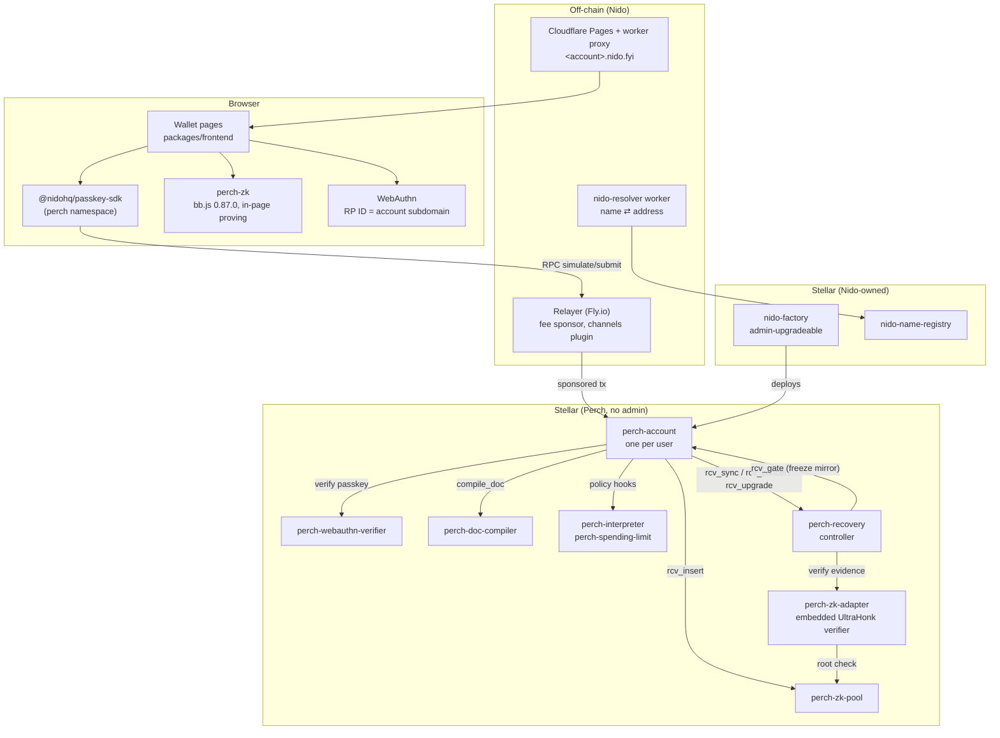
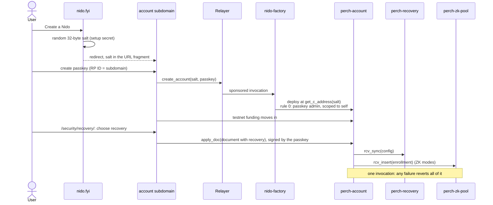
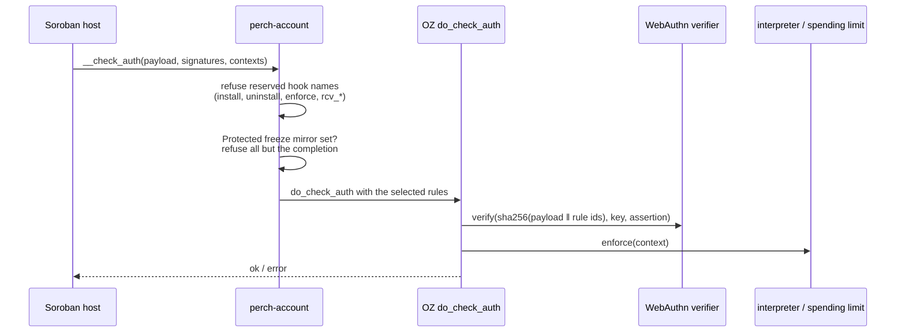
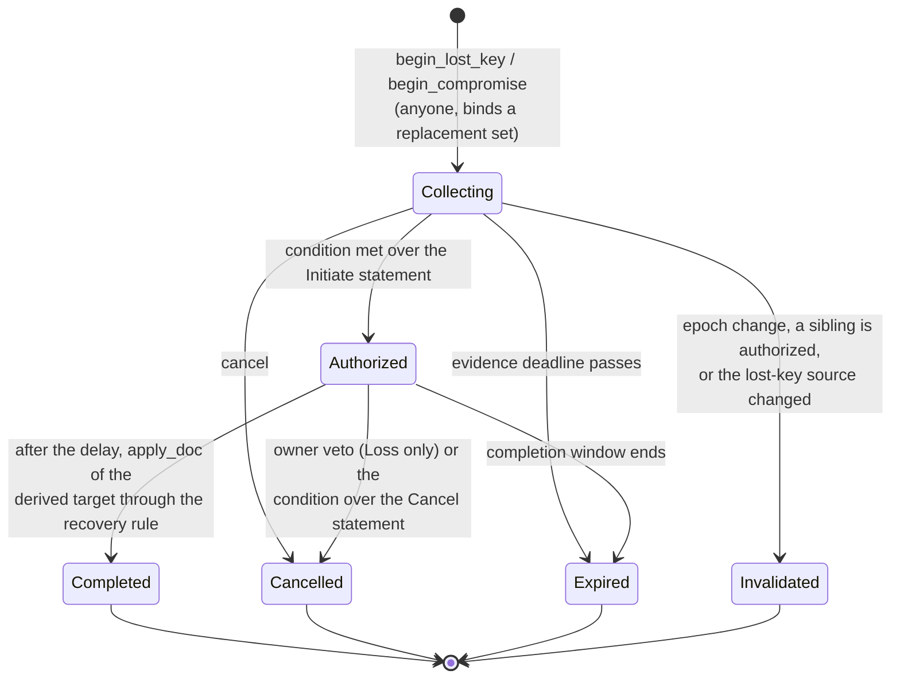

# Architecture

Nido is a passkey wallet for Stellar smart accounts. A user's account is a
Soroban contract (a `C...` address) whose signers are WebAuthn passkeys,
verified on chain. Nido's accounts are [Perch](https://github.com/stellar-registry/perch)
smart accounts: every rule, signer, and recovery setting is declared in one
policy document that the account compiles and installs through a single entry
point, `apply_doc`.

This file describes how the pieces fit. The audit package around it:

| Document | What it answers |
| --- | --- |
| [docs/AUDIT_SCOPE.md](docs/AUDIT_SCOPE.md) | What is in and out of scope, the frozen revisions, the reading order |
| [docs/THREAT_MODEL.md](docs/THREAT_MODEL.md) | Assets, adversaries, trust assumptions |
| [docs/SECURITY_INVARIANTS.md](docs/SECURITY_INVARIANTS.md) | Properties that must hold, each with the test that pins it |
| [docs/SUPPLY_CHAIN.md](docs/SUPPLY_CHAIN.md) | Every third-party input and how it is pinned |
| [docs/RUNBOOKS.md](docs/RUNBOOKS.md) | Build, deploy, operate, respond |
| [docs/MAINNET_READINESS.md](docs/MAINNET_READINESS.md) | What must be true before mainnet |
| [DEPLOYED.md](DEPLOYED.md) | What is deployed where |

Recovery semantics are Perch's, and Perch's specification is the single
source of truth for them: [`vendor/perch/docs/recovery/spec.md`](vendor/perch/docs/recovery/spec.md).
This file summarizes it only as far as Nido's integration needs.

## 1. Components

```mermaid
graph TB
    subgraph Browser
        Pages["Wallet pages<br/>packages/frontend"]
        SDK["@nidohq/passkey-sdk<br/>(perch namespace)"]
        ZK["perch-zk<br/>bb.js 0.87.0, in-page proving"]
        WebAuthn["WebAuthn<br/>RP ID = account subdomain"]
        Pages --> SDK
        Pages --> ZK
        Pages --> WebAuthn
    end

    subgraph "Off-chain (Nido)"
        CF["Cloudflare Pages + worker proxy<br/>&lt;account&gt;.nido.fyi"]
        Relayer["Relayer (Fly.io)<br/>fee sponsor, channels plugin"]
        Resolver["nido-resolver worker<br/>name ⇄ address"]
    end

    subgraph "Stellar (Nido-owned)"
        Factory["nido-factory<br/>admin-upgradeable"]
        Names["nido-name-registry"]
    end

    subgraph "Stellar (Perch, no admin)"
        Account["perch-account<br/>one per user"]
        Verifier["perch-webauthn-verifier"]
        Compiler["perch-doc-compiler"]
        Interp["perch-interpreter<br/>perch-spending-limit"]
        Controller["perch-recovery<br/>controller"]
        Pool["perch-zk-pool"]
        Adapter["perch-zk-adapter<br/>embedded UltraHonk verifier"]
    end

    CF --> Pages
    SDK -- "RPC simulate/submit" --> Relayer
    Relayer -- "sponsored tx" --> Account
    Factory -- "deploys" --> Account
    Account -- "verify passkey" --> Verifier
    Account -- "compile_doc" --> Compiler
    Account -- "policy hooks" --> Interp
    Account -- "rcv_sync / rcv_cancel / rcv_upgrade" --> Controller
    Controller -- "rcv_gate (freeze mirror)" --> Account
    Account -- "rcv_insert" --> Pool
    Controller -- "verify evidence" --> Adapter
    Adapter -- "root check" --> Pool
    Resolver --> Names
```

### Contracts Nido deploys

| Contract | Path | Role |
| --- | --- | --- |
| `nido-factory` | `contracts/factory/` | `create_account(salt, key)` deploys a `perch-account` at the address `get_c_address(salt)` predicts, with one constructor rule: the passkey `key` as admin, scoped to the account itself, checked by Perch's WebAuthn verifier. It embeds the release's account wasm and deploys by its hash. Admin-upgradeable (`admin-sep`); the admin pins the verifier (`set_registry_pins`) so the registry is off the creation path. Perch's own factory can't replace it: its addresses commit to the admin signers, and a Nido passkey's RP ID is the account's own subdomain, so the address has to exist before the passkey. |
| `nido-name-registry` | `contracts/name-registry/` | Human-readable names for accounts. |
| `nido-multisig-policy`, `nido-spending-limit-policy`, `nido-preauth-sweep-policy` | `contracts/*-policy/` | OZ policies from before Perch. A Perch document attaches only Perch's interpreter and spending limit, so these cannot be installed on a fresh account. Kept until a product decision retires or ports them. |
| `nido-status-message` | `contracts/status-message/` | Demo contract for the example dApp. |

### Contracts Nido consumes from Perch

Deployed by Perch's release workstream (stellar-registry/perch#99 WS4), not by
Nido, and recorded in `vendor/perch/deployments/testnet.json` (DEPLOYED.md).
Nido's tests run those exact bytes, fetched by hash (see
[docs/SUPPLY_CHAIN.md](docs/SUPPLY_CHAIN.md)).

| Contract | Role |
| --- | --- |
| `perch-account` | The user's account. `apply_doc(doc_json, approval_valid_until, expected_revision)` is the only way to change its rules: it compiles the document, checks it, synchronizes recovery with the controller, and installs the result as OZ context rules. `execute` runs ordinary calls. `schedule_upgrade` / `execute_upgrade` / `cancel_upgrade` are the seven-day upgrade path. Each apply advances the account's configuration revision and emits one `DocApplied` (the hash, the new revision, and counts of rules, signers, and policies changed; OZ's per-mutation events are silenced). With `expected_revision`, an apply prepared at an older revision is refused (`StaleRevision`); the wallet doesn't pass it yet (MAINNET_READINESS D8). `revision()`, `configuration()`, and `document()` read the state with the revision it belongs to. A document holds at most 8 signers, 11 rules, and 8192 canonical bytes. |
| `perch-webauthn-verifier` | OZ `Verifier` for secp256r1 passkey assertions, shared by every account. Constructorless, no admin. |
| `perch-doc-compiler` | Stateless `compile_doc`: document JSON to compiled rules. The account pins its address. |
| `perch-interpreter`, `perch-spending-limit` | OZ policies the compiled rules attach. |
| `perch-recovery` | The recovery controller: attempts, guardian and ZK evidence, change approvals, baselines, epochs, cancellation, completion. Constructorless and immutable. |
| `perch-zk-pool` | Depth-32 membership pool of ZK enrollment commitments. Every historical root stays valid; a full tree rolls over. |
| `perch-zk-adapter` | Checks a proof's circuit id, root membership, and statement binding, then verifies it with the embedded UltraHonk verifier (audited, plus Perch's unaudited zero-knowledge-flavor delta). |

### Off-chain

| Component | Path | Role |
| --- | --- | --- |
| Wallet | `packages/frontend/` | Static Astro site on Cloudflare Pages. Each account lives at its own subdomain, `<contract-id>.nido.fyi`, served by the worker proxy in `frontend/worker-proxy-nido/`. All chain access is client-side. |
| Passkey SDK | `packages/passkey-sdk/` | WebAuthn parsing, Soroban auth, policy documents, and the `perch` namespace: statement encodings, recovery as document changes, controller and account clients. `@nidohq/passkey-sdk/perch-zk` proves. |
| Contract bindings | `packages/contract-bindings/` | Generated clients, including `perch-*` clients generated from the deployed Perch wasm (private until Perch publishes `@stellar-registry/perch-contracts`). |
| Relayer | `infra/relayer/` | OpenZeppelin relayer with the channels plugin. Pays fees for transactions whose authorization is already complete. It cannot authorize anything for an existing account; it does see each setup salt before the account exists (THREAT_MODEL 10). |
| Name resolver | `infra/nido-resolver/` | Serves `/.well-known/nido.json` from the name registry. Read-only. |

## 2. Subdomain isolation

The WebAuthn RP ID is the account's own hostname, so a passkey created for one
account can only sign on that account's subdomain. A guardian approves from
their own Nido's subdomain, signing through their own account. The apex origin
holds no passkey. A storage bridge (`/nido-storage-bridge/`,
`packages/frontend/src/pages/nido-storage-bridge/`) shares the
browser's account list, names, and the setup keys of accounts still being
created across the apex and account origins.

## 3. Onboarding

```mermaid
sequenceDiagram
    actor User
    participant Apex as nido.fyi
    participant Sub as account subdomain
    participant Relayer
    participant Factory as nido-factory
    participant Account as perch-account
    participant Ctl as perch-recovery
    participant Pool as perch-zk-pool

    User->>Apex: Create a Nido
    Apex->>Apex: random 32-byte salt (setup secret)
    Apex-->>Sub: redirect, salt in the URL fragment
    User->>Sub: create passkey (RP ID = subdomain)
    Sub->>Relayer: create_account(salt, passkey)
    Relayer->>Factory: sponsored invocation
    Factory->>Account: deploy at get_c_address(salt)<br/>rule 0: passkey admin, scoped to self
    Sub->>Account: testnet funding moves in
    User->>Sub: /security/recovery/: choose recovery
    Sub->>Account: apply_doc(document with recovery), signed by the passkey
    Account->>Ctl: rcv_sync(config)
    Account->>Pool: rcv_insert(enrollment) (ZK modes)
    Note over Account,Pool: one invocation: any failure reverts all of it
```

The salt is a setup secret: whoever holds it can call `create_account` with
their own key first. It travels in the URL fragment and is scrubbed from the
address bar on load. During setup it is also kept in a `nido_setup_<account>`
cookie on the parent domain (30 minutes), so it is sent with requests to
Nido's subdomains until the account exists.

Until the first `apply_doc`, the account has only its admin rule and no
recovery. Recovery is enrolled by that `apply_doc`: the account synchronizes
the configuration with the controller and inserts the ZK leaf into the pool in
the same invocation, so there is never an account that is configured but not
enrolled, or the reverse.

## 4. Authorization

```mermaid
sequenceDiagram
    participant Host as Soroban host
    participant Account as perch-account
    participant OZ as OZ do_check_auth
    participant WV as WebAuthn verifier
    participant Policy as interpreter / spending limit

    Host->>Account: __check_auth(payload, signatures, contexts)
    Account->>Account: refuse reserved hook names<br/>(install, uninstall, enforce, rcv_*)
    Account->>Account: Protected freeze mirror set?<br/>refuse all but the completion
    Account->>OZ: do_check_auth with the selected rules
    OZ->>WV: verify(sha256(payload ‖ rule ids), key, assertion)
    OZ->>Policy: enforce(context)
    OZ-->>Host: ok / error
```

The freeze mirror lives in the account's own storage. The controller sets it
through the invoker-only `rcv_gate` hook; `__check_auth` never reads another
contract (Perch spec D16).

## 5. Recovery

Each account chooses a profile and a mode:

| | GuardianOnly | ZkOnly | Combined |
| --- | --- | --- | --- |
| **Loss** (the passkey may be lost, not stolen) | guardian quorum | proof from the recovery kit | both |
| **Protected** (the passkey may be stolen) | same, and the condition also gates reconfiguration, upgrades, and the authorized window | same | same |

A recovery attempt:

```mermaid
stateDiagram-v2
    [*] --> Collecting: begin_lost_key / begin_compromise<br/>(anyone, binds a replacement set)
    Collecting --> Authorized: condition met over the Initiate statement
    Collecting --> Expired: evidence deadline passes
    Collecting --> Cancelled: cancel
    Collecting --> Invalidated: epoch change, a sibling is authorized,<br/>or the lost-key source changed
    Authorized --> Completed: after the delay, apply_doc of the<br/>derived target through the recovery rule
    Authorized --> Cancelled: owner veto (Loss only) or the<br/>condition over the Cancel statement
    Authorized --> Expired: completion window ends
    Completed --> [*]
    Cancelled --> [*]
    Expired --> [*]
    Invalidated --> [*]
```

- Evidence binds one `RecoveryStatement`: the network, account, controller,
  epoch and configuration hash, timing, and the subject (for an attempt, its
  id, the source and target document hashes, and the replacement-set hash).
  The controller builds it from its own state. Guardians authorize its digest
  from their own accounts; the circuit binds it through its `statement_hash`
  public input.
  ([statement.md](vendor/perch/docs/recovery/statement.md))
- The target document is derived on chain from the source document and the
  replacement set. Nobody supplies a target hash. Completion is the account's
  `apply_doc` of that target through a zero-signer rule the controller
  authorizes, and it bumps the epoch, revokes the replaced credentials, and
  spends the ZK nullifier.
- Under `Protected`, an authorized attempt freezes the account: nothing but
  that completion is authorized. Under `Loss`, ordinary activity continues and
  the owner can veto.

Wallet pages:

| Page | Code | Does |
| --- | --- | --- |
| `/security/recovery/` | `lib/recovery/settingsPage.ts` | Set, change, or turn off recovery; create a recovery kit; collect a Protected account's condition for the change; owner veto. |
| `/security/recover/` | `lib/recovery/recoverPage.ts` | From a new device: new passkey, open an attempt, share guardian links, prove with the kit, finish. |
| `/security/guardian/` | `lib/recovery/guardianPage.ts` | A guardian approves an attempt, its cancellation, or a change from their own Nido or a G wallet. The page checks the request against the chain and offers no Approve button when it doesn't match. |
| `/account/policy/` | `lib/policy/docPolicyFetch.ts`, `lib/recovery/upgradesPanel.ts` | Read the applied document; schedule, execute, or cancel an upgrade. |

## 6. Changing recovery, and upgrades

- `Loss`: the owner changes recovery with an ordinary `apply_doc`.
- `Protected`: the enrolled condition first records its approval of a
  `Reconfigure` statement that binds the new configuration hash; the owner's
  `apply_doc` then consumes it, with `approval_valid_until` naming the
  statement. Rotating a passkey is not a reconfiguration.
- Upgrades: the owner schedules a Wasm hash; it can run after 120,960 ledgers
  (about seven days). `Protected` accounts also need the condition over an
  `Upgrade` statement. Any epoch change makes a queued upgrade stale, and an
  authorized attempt blocks both scheduling and execution.

## 7. Where the rules are tested

`crates/integration-tests/` runs every contract from its wasm under enforcing
authorization, with P-256 passkeys signing what a browser signs and real
UltraHonk proofs of Perch's release circuit. See
[docs/SECURITY_INVARIANTS.md](docs/SECURITY_INVARIANTS.md) for the map from
property to test.
