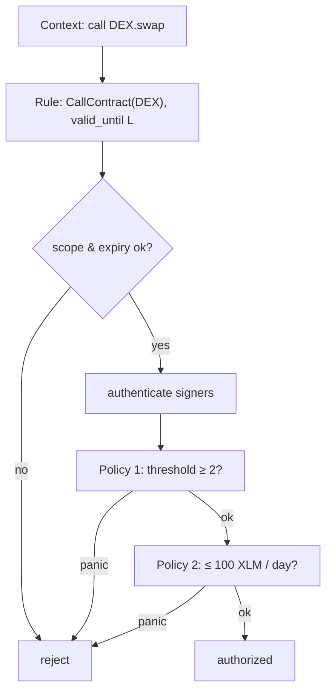

# Scoped Sessions & Custom Policies

> **Series — Smart Accounts on Stellar, Part 4 of 5.**
> [Part 1](./01-stellar-smart-accounts-oz-standard.md) introduced the three
> layers (signers / context rules / policies); Parts
> [2](./02-how-g2c-uses-oz-smart-accounts.md) and
> [3](./03-passkeys-and-on-chain-webauthn.md) covered the passkey signer in depth.
> This post is about the other two layers: **how to grant an account *less than
> total* authority** — scoped session keys, and policies you write yourself. See
> the [series index](./README.md) for the roadmap.

So far the account has had exactly one signer — your passkey — and one rule — the
`Default` that lets it do anything. That's correct for an owner key. But a lot of
what makes smart accounts genuinely better than a private key is the ability to
hand out **narrow, revocable, conditional** authority: a key that can only trade
on one DEX, a budget that caps daily spend, a 2-of-3 that guards admin actions.

The standard gives you two independent tools for that, and they compose:

- **Context rules** bound *scope and lifetime* — *which* contract, *until when*.
- **Policies** add *conditions* — *how many* signers, *how much* per period.

Use a rule alone for a session key. Add a policy when scope isn't enough. Let's do
both, then write a policy from scratch.

---

## Scoped session keys: a rule, no policy

A **session key** is a throwaway keypair you authorize for one narrow purpose so
your real passkey can stay out of a hot loop (a game, a trading UI, a subscription)
— and that you can revoke the instant you're done. In the OZ model that's just a
context rule scoped to one contract, holding a session signer, with an optional
expiry. No policy required.

[Nido](https://nido.fyi)'s SDK builds exactly that — note it's a thin wrapper over
the `add_context_rule` you met in Part 1:

```ts
// packages/passkey-sdk/src/policyBlocks/scopedSessionKey.ts (trimmed)
const tx = await client.add_context_rule({
  context_type: { tag: 'CallContract', values: [args.block.targetContract] },
  name: args.block.label ?? 'session',
  valid_until: args.block.validUntil,                 // optional expiry (ledger seq)
  signers: [{
    tag: 'External',
    values: [verifierAddr, Buffer.from(args.block.sessionPubkey)],  // the session passkey
  }],
  policies: new Map(),                                 // ← no policy: scope IS the limit
});
```

Revocation is the mirror image — remove the rule and the key is dead:

```ts
// packages/passkey-sdk/src/policyBlocks/scopedSessionKey.ts
const tx = await client.remove_context_rule({ context_rule_id: args.ruleId });
```

What did that buy you? Four properties, all enforced on-chain by `do_check_auth`
(Part 1) with **zero custom contract code**:

1. **Scope** — the key authorizes calls to `targetContract` and *nothing else*. A
   `CallContract(X)` rule only matches a `Context` that calls `X`.
2. **Expiry** — set `valid_until` and the rule self-disables at that ledger.
3. **Revocation** — `remove_context_rule` kills it immediately.
4. **No over-reach** — the session key never has more authority than the rule
   grants. It can't be tricked into signing for your `Default` rule, because the
   signature is bound to the rule id it was issued under (the digest binding from
   Part 1/3).

We proved all four in Part 2 with integration tests
(`scoped_session_key.rs`: in-scope passes; out-of-scope, expired, and revoked all
reject). The point worth internalizing: a session key is strictly *weaker* than
your owner key by construction, so handing one to a dApp is a bounded risk — the
opposite of "approve unlimited."

---

## When scope isn't enough: policies

Scope answers *which contract*. It doesn't answer *how much* or *how many*. For
that you attach a **policy** — a separate contract that runs during authorization
and can **panic to veto** the operation.

Recall the trait from Part 1:

```rust
// stellar-accounts: policies/mod.rs
pub trait Policy {
    type AccountParams: FromVal<Env, Val>;
    fn enforce(e: &Env, context: Context, authenticated_signers: Vec<Signer>, context_rule: ContextRule, smart_account: Address);
    fn install(e: &Env, install_params: Self::AccountParams, context_rule: ContextRule, smart_account: Address);
    fn uninstall(e: &Env, context_rule: ContextRule, smart_account: Address);
}
```

The lifecycle: `install` runs when the policy is attached to a rule (validate and
store config), `enforce` runs on every authorization (check and, crucially,
**panic if the condition fails**), `uninstall` cleans up. The library ships three
ready-made policy modules — `simple_threshold`, `weighted_threshold`, and
`spending_limit` — and you write a policy by wrapping one, or from scratch.

### Anatomy of a policy contract

A policy is its own deployed contract. The thinnest possible one delegates every
method to a library module — this is Nido's multisig policy, in full:

```rust
// contracts/multisig-policy/src/contract.rs
#[contractimpl]
impl Policy for MultisigPolicy {
    type AccountParams = SimpleThresholdAccountParams;

    fn enforce(e: &Env, context: Context, authenticated_signers: Vec<Signer>, context_rule: ContextRule, smart_account: Address) {
        simple_threshold::enforce(e, &context, &authenticated_signers, &context_rule, &smart_account);
    }
    fn install(e: &Env, install_params: Self::AccountParams, context_rule: ContextRule, smart_account: Address) {
        simple_threshold::install(e, &install_params, &context_rule, &smart_account);
    }
    fn uninstall(e: &Env, context_rule: ContextRule, smart_account: Address) {
        simple_threshold::uninstall(e, &context_rule, &smart_account);
    }
}
```

The key structural fact: a policy stores its state **keyed by `(smart_account,
context_rule_id)`**, so one deployed policy contract can serve every account that
installs it. `simple_threshold::enforce` is about as simple as enforcement gets —
require the account's auth, read the stored threshold, count:

```rust
// stellar-accounts: policies/simple_threshold.rs
pub fn enforce(e: &Env, context: &Context, authenticated_signers: &Vec<Signer>, context_rule: &ContextRule, smart_account: &Address) {
    smart_account.require_auth();
    let threshold = get_threshold(e, context_rule.id, smart_account);
    if authenticated_signers.len() >= threshold {
        SimpleEnforced { /* … event … */ }.publish(e);
    } else {
        panic_with_error!(e, SimpleThresholdError::NotAllowed)   // ← veto
    }
}
```

### A policy with teeth: spending limits

`spending_limit` is more interesting because it's **stateful and amount-aware**.
Its params and enforcement:

```rust
// stellar-accounts: policies/spending_limit.rs
pub struct SpendingLimitAccountParams {
    pub spending_limit: i128,   // max stroops per window
    pub period_ledgers: u32,    // rolling window length (e.g. 17280 ≈ 1 day)
}

pub fn enforce(e: &Env, context: &Context, authenticated_signers: &Vec<Signer>, context_rule: &ContextRule, smart_account: &Address) {
    smart_account.require_auth();
    if authenticated_signers.is_empty() { panic_with_error!(e, SpendingLimitError::NotAllowed) }

    let mut data = get_spending_limit_data(e, context_rule.id, smart_account);
    let current_ledger = e.ledger().sequence();

    match context {
        Context::Contract(ContractContext { fn_name, args, .. }) => {
            if fn_name == &symbol_short!("transfer") {
                if let Some(amount_val) = args.get(2) {                // transfer(from, to, AMOUNT)
                    if let Ok(amount) = i128::try_from_val(e, &amount_val) {
                        if amount < 0 { panic_with_error!(e, SpendingLimitError::LessThanZero) }
                        // evict entries older than the rolling window, then check the cap
                        let removed = cleanup_old_entries(&mut data.spending_history, current_ledger, data.period_ledgers);
                        data.cached_total_spent -= removed;
                        if data.cached_total_spent + amount > data.spending_limit {
                            panic_with_error!(e, SpendingLimitError::SpendingLimitExceeded)   // ← veto
                        }
                        data.spending_history.push_back(SpendingEntry { amount, ledger_sequence: current_ledger });
                        data.cached_total_spent += amount;
                        e.storage().persistent().set(&key, &data);
                        return;
                    }
                }
            }
        }
        _ => panic_with_error!(e, SpendingLimitError::NotAllowed),
    }
    panic_with_error!(e, SpendingLimitError::NotAllowed)
}
```

Three details worth lifting out, because they shape how you'd write your own:

- **It introspects the call.** The policy reaches into the `Context` — `fn_name ==
  "transfer"`, `args.get(2)` as the amount — to find what's being spent. A policy
  isn't limited to counting signers; it can inspect exactly what operation is
  being authorized.
- **It's transfer-shaped.** It assumes a SEP-41-style `transfer(from, to, amount)`
  with the amount at index 2. That's an *assumption baked into this policy*, not a
  property of the framework — a different operation needs a different policy.
- **It bounds its own storage.** `spending_history` is capped at
  `MAX_HISTORY_ENTRIES = 1000` to prevent a storage-DoS, and old entries are
  evicted each call so the rolling window stays honest.

### Writing your own policy

Want something the library doesn't ship — say, an **allow-list** that only lets a
session key call a specific set of functions? The shape follows directly from the
two examples above. Store the list in `install`, then in `enforce` inspect the
`Context` and panic if it's not allowed:

```rust
// Illustrative — a from-scratch allow-list policy following the OZ Policy shape
#[contractimpl]
impl Policy for AllowlistPolicy {
    type AccountParams = AllowedFns;   // e.g. a Vec<Symbol> of permitted fn names

    fn install(e: &Env, params: Self::AccountParams, rule: ContextRule, account: Address) {
        account.require_auth();
        e.storage().persistent().set(&Key::Allowed(account, rule.id), &params.fns);
    }

    fn enforce(e: &Env, context: Context, _signers: Vec<Signer>, rule: ContextRule, account: Address) {
        account.require_auth();
        let allowed: Vec<Symbol> = e.storage().persistent().get(&Key::Allowed(account.clone(), rule.id)).unwrap();
        match context {
            Context::Contract(ContractContext { fn_name, .. }) if allowed.contains(fn_name) => { /* ok */ }
            _ => panic_with_error!(e, AllowlistError::NotAllowed),   // ← veto everything else
        }
    }

    fn uninstall(e: &Env, rule: ContextRule, account: Address) {
        account.require_auth();
        e.storage().persistent().remove(&Key::Allowed(account, rule.id));
    }
}
```

That's the whole contract surface. Deploy it once, and any account can
`add_policy(rule_id, allowlist_addr, params)` to attach it. The framework calls
`enforce` for you inside `do_check_auth`; you just decide pass-or-panic.

---

## Composing policies on one rule

A context rule can carry **up to 5 policies**, and enforcement is
**all-or-nothing** — *every* policy must pass (Part 1). So "this session key may
call the DEX, needs 2 signatures, and can't move more than 100 XLM/day" is one
rule with two policies. You attach them through the `policies` map that
`add_context_rule` already takes — `Map<policy_address, install_param>`:

```rust
// Map<Address, Val>: each policy contract → its typed install parameter
let mut policies: Map<Address, Val> = Map::new(e);
policies.set(threshold_policy, SimpleThresholdAccountParams { threshold: 2 }.into_val(e));
policies.set(spending_policy,  SpendingLimitAccountParams { spending_limit: 1_000_000_000, period_ledgers: 17280 }.into_val(e));
// add_context_rule(CallContract(dex), "trading", valid_until, signers, &policies)
```

At authorization time, `do_check_auth` validates the rule, authenticates the
signers, then loops every policy calling `enforce` — any single panic vetoes the
whole transaction.



---

## The footgun: threshold ↔ signer-set divergence

We flagged this in Part 1; here's the operational rule. A `simple_threshold`
policy stores its number at **install time** and is **never notified** when you
later add or remove signers from the rule. The library is blunt about the
consequences:

> - **Silent weakening:** add 2 signers to a strict 3-of-3 and you now have a
>   3-of-5 — 60% where you intended 100%.
> - **Permanent lockout (DoS):** remove 2 signers from a 5-of-5 and only 3 remain;
>   the threshold of 5 can never be met again.

The policy exposes `set_threshold` precisely so you can keep the two in sync, and
its doc states the discipline exactly:

```rust
// stellar-accounts: policies/simple_threshold.rs
/// **ALWAYS call this function BEFORE removing and AFTER adding signers** from
/// the ContextRule to maintain the desired security level and avoid DoS or
/// security degradation.
pub fn set_threshold(e: &Env, threshold: u32, context_rule: &ContextRule, smart_account: &Address) { /* … */ }
```

The safe pattern is to do both in **one transaction** so the rule is never in a
weakened state on-chain: `add_signer(rule, new_friend)` **and** `set_threshold(rule,
new_threshold)` together. Treat "change a multisig's membership" as a single atomic
operation, never two.

---

## Recap

Two layers, composable:

- **Context rules** give you scope and lifetime — that alone is a complete,
  revocable session key with no custom code.
- **Policies** add programmable conditions; you write one by implementing three
  methods (`install` / `enforce` / `uninstall`), storing state keyed by
  `(account, rule_id)`, and panicking in `enforce` to veto.

And remember the discipline: a stateful policy like a threshold has invariants the
framework won't maintain for you — keep them in sync atomically.

---

## Next in the series

[**Part 5 — Social Recovery**](./05-social-recovery.md): the finale. Friends who
are themselves smart accounts, the `Delegated`-signer **nested-auth** flow, the
byte-identical-digest requirement across parties, and the `CallContract(self)`
scope that lets friends rebuild you without being able to rob you.

See the [series index](./README.md) for the roadmap.
