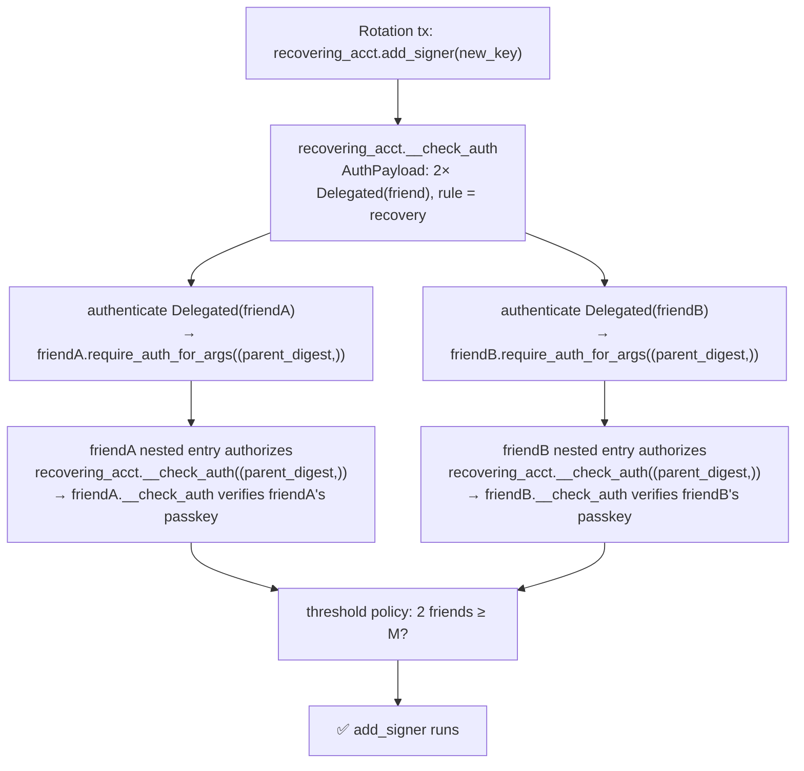

# Social Recovery: Friends Who Can Rebuild You, But Can't Rob You

> **Series — Smart Accounts on Stellar, Part 5 of 5.** The finale. Parts
> [1](./01-stellar-smart-accounts-oz-standard.md)–[4](./04-scoped-sessions-and-custom-policies.md)
> built up signers, context rules, the passkey verifier, and policies. This post
> spends all of it at once on the hardest feature in any seedless wallet:
> **recovering an account when the device is gone.** See the
> [series index](./README.md) for the whole roadmap.

A passkey wallet is a wonderful thing right up until the moment someone drops their
only phone in a lake. There's no seed phrase to fall back on — that was the whole
selling point — so "what happens when I lose the device?" is the question that
makes or breaks the model.

[Nido](https://nido.fyi)'s answer is **social recovery**: you nominate a few
trusted friends, and a quorum of them can together add a *new* signer to your
account. The design constraint that makes this scary is sharp:

> Your friends must be able to **fix your keys** without ever being able to **move
> your money** — and no single friend should be able to act alone.

Every layer from this series shows up in the solution. Let's assemble it.

---

## The recovery rule (recap from Part 2)

Recovery is one context rule, installed by `add_multisig_recovery`. Two properties
do all the safety work:

```rust
// contracts/smart-account/src/contract.rs (recap)
pub fn add_multisig_recovery(e: &Env, name: String, valid_until: Option<u32>,
                             friends: Vec<Signer>, multisig_policy: Address, threshold: u32) -> ContextRule {
    e.current_contract_address().require_auth();
    let install: Val = SimpleThresholdAccountParams { threshold }.into_val(e);
    let mut policies: Map<Address, Val> = Map::new(e);
    policies.set(multisig_policy, install);
    add_context_rule(
        e,
        &ContextRuleType::CallContract(e.current_contract_address()),  // ← scoped to SELF
        &name, valid_until, &friends, &policies,                        // ← M-of-N over friends
    )
}
```

- **`CallContract(self)`** scope: the rule can only authorize calls *to your own
  account's methods* — `add_signer`, `add_context_rule`, and friends. It can
  **never** match a `Context` that transfers a token to a third party, because
  that's a call to a *different* contract (Part 1's context-type matching). That's
  the "can't rob you" guarantee, and it's structural — not a check someone has to
  remember to write.
- **M-of-N threshold policy**: a quorum is required (Part 4's `simple_threshold`).
  That's the "no single friend acts alone" guarantee.

So far, so Part 4. The genuinely new and tricky part is *who the friends are* and
*how they sign*.

---

## Friends are accounts, not keys: the `Delegated` signer

A friend isn't a raw public key you hold — they're a *person with their own Nido
account and their own passkey*. You don't want their key bytes; you want **them**
to authorize, with their own Face ID, on their own device. The standard models
exactly this with the *other* signer variant from Part 1:

```rust
pub enum Signer {
    Delegated(Address),          // ← a friend: defer to their own account's auth
    External(Address, Bytes),    // ← a passkey: verify a signature here
}
```

And here is the asymmetry that makes recovery subtle. Recall `authenticate` from
Part 1 — the two variants take completely different paths:

```rust
// stellar-accounts: smart_account/storage.rs (authenticate, trimmed)
match signer {
    Signer::External(verifier, key_data) => {
        // verify the signature bytes from the AuthPayload map, right here
        let sig_payload = auth_digest.to_bytes().to_bytes();
        VerifierClient::new(e, verifier).verify(&sig_payload, &key_data.into_val(e), &sig_data.into_val(e)) /* else panic */
    }
    Signer::Delegated(addr) => {
        // defer: the friend's own account must authorize these args
        addr.require_auth_for_args((auth_digest.clone(),).into_val(e))
    }
}
```

For a `Delegated` friend, **the bytes in the signer map are ignored.** Authorization
doesn't happen by checking a signature inline — it happens by the recovering account
calling `friend.require_auth_for_args((auth_digest,))`, which the Soroban host
satisfies from a **nested authorization entry** in the transaction. The SDK spells
this out:

```ts
// packages/passkey-sdk/src/multiSigner.ts
//   match signer {
//     External(verifier, key) => verifier.verify(auth_digest, key, sig_bytes),
//     Delegated(addr)         => addr.require_auth_for_args((auth_digest,)),
//   }
// Note the asymmetry: for a `Delegated` signer the `Bytes` value in the map is
// IGNORED — authorization happens through a *nested* Soroban auth entry where
// the friend's own account authorizes the args `(auth_digest,)`.
```

So a delegated friend needs **two** things in the submitted transaction: a (mostly
empty) entry in the parent's signer map so the contract iterates and calls
`require_auth` on them, **and** a nested auth entry carrying their real signature.
That nested entry is where all the danger lives.

---

## The nested auth entry: what the friend actually signs

Here's the trap that eats days if you don't know it. When the recovering account
calls `friend.require_auth_for_args((auth_digest,))`, the Soroban host builds the
*expected* authorized invocation **from the current call-stack frame** — which is
the **recovering account's `__check_auth`** — not from the friend's address. So the
friend's nested `SorobanAuthorizationEntry` must authorize an invocation of *the
recovering account*, not of themselves:

```ts
// packages/passkey-sdk/src/friendSigning.ts
// A friend authorizes: recovering_account.__check_auth((parent_auth_digest,))
export function buildFriendInvocation(recoveringAccount: string, parentAuthDigestHex: string): xdr.SorobanAuthorizedInvocation {
  const argScVal = xdr.ScVal.scvBytes(Buffer.from(hex2buf(parentAuthDigestHex)));
  return new xdr.SorobanAuthorizedInvocation({
    function: xdr.SorobanAuthorizedFunction.sorobanAuthorizedFunctionTypeContractFn(
      new xdr.InvokeContractArgs({
        contractAddress: Address.fromString(recoveringAccount).toScAddress(),  // ← NOT the friend
        functionName: '__check_auth',
        args: [argScVal],                                                      // ← the parent digest
      }),
    ),
    subInvocations: [],
  });
}
```

The friend then computes the **signature payload for their own nested entry** and
signs *that* digest with their primary passkey — the same passkey ceremony from
Part 3, just over a different digest:

```ts
// packages/passkey-sdk/src/friendSigning.ts
// signature_payload = sha256( HashIdPreimageSorobanAuthorization{ networkId, nonce,
//                              signatureExpirationLedger, invocation = buildFriendInvocation(...) } )
// then the friend signs:  auth_digest = sha256(signature_payload || [0].to_xdr())   (computeAuthDigest, rule 0)
export function friendSignaturePayload(args): Buffer {
  const preimage = xdr.HashIdPreimage.envelopeTypeSorobanAuthorization(
    new xdr.HashIdPreimageSorobanAuthorization({
      networkId: hash(Buffer.from(args.networkPassphrase, 'utf-8')),
      nonce: xdr.Int64.fromString(args.nonce),
      signatureExpirationLedger: args.signatureExpirationLedger,
      invocation: buildFriendInvocation(args.recoveringAccount, args.parentAuthDigestHex),
    }),
  );
  return hash(preimage.toXDR());
}
```

Notice the recursion: the friend authorizes the recovering account's `__check_auth`
*through their own* `__check_auth`, which verifies *their* passkey (Part 3, all over
again). Recovery is `__check_auth` calling `__check_auth`.



### One digest, every party: the absolute-ledger rule

For the host to match a friend's nested entry against the
`require_auth_for_args((auth_digest,))` call, **everyone must arrive at the exact
same `parent_auth_digest` — byte for byte.** That digest is built from the parent
auth entry's preimage, which includes a `signatureExpirationLedger`. If the
originator, each friend, and the submitting wallet each resolve that from their own
*live* ledger, the values diverge and every signature is silently invalid.

The fix (introduced in Part 2's `buildAuthHashAt`): freeze **one absolute
expiration ledger** up front and ship it to everyone. The recovery handoff carries
it explicitly, with a warning attached:

```ts
// packages/passkey-sdk/src/friendSigning.ts
/**
 * The CANONICAL absolute `signatureExpirationLedger` for the PARENT auth entry.
 * Chosen once by the originator and frozen here. Every party — originator, each
 * friend, and the chain — must feed exactly this value into the parent auth-digest
 * preimage, or the digests diverge and the host rejects the nested entries.
 * Friends MUST NOT recompute it from a live ledger.
 */
parentSignatureExpirationLedger: number;
```

---

## The handoff: collecting signatures out of band

Friends are on different devices, so recovery is a small coordination protocol. The
originator encodes a `RotationHandoff` — including the **whole unsigned transaction**
so each friend can reconstruct the auth tree — and shares a link. Each friend
decodes it, reviews, signs with their passkey, and hands back a `FriendSignature`:

```ts
// packages/passkey-sdk/src/friendSigning.ts (shapes, trimmed)
export interface RotationHandoff {
  account: string;                          // the account being recovered
  recoveryRuleId: number;                   // which rule authorizes this
  txXdr: string;                            // the assembled, unsigned rotation tx
  friends: string[];                        // all friend accounts asked to sign
  parentSignatureExpirationLedger: number;  // the frozen absolute ledger (above)
}

export interface FriendSignature {
  friendAccount: string;                    // the Delegated signer
  publicKey: Uint8Array;                    // friend's 65-byte P-256 key
  authenticatorData: Uint8Array; clientDataJson: Uint8Array; signature: Uint8Array;  // their assertion
  nonce: string; signatureExpirationLedger: number;  // their nested entry's params
}
```

> Why ship the whole transaction rather than just a digest? Because a `Delegated`
> friend has to *build a valid nested auth entry*, and to do that their wallet must
> see the real invocation tree — derive its own sub-invocation, compute its own
> `signature_payload`, and sign. Sharing the assembled tx lets the friend
> reconstruct exactly that, and lets the originator splice the returned signature
> back into the same tree before submitting.

Once the originator has M friend signatures, they assemble the final `AuthPayload`.
For delegated signers the map value is empty — the real proof is in the nested
entries — and the SDK is careful to **sort the map by XDR key** (Soroban traps on
out-of-order map keys):

```ts
// packages/passkey-sdk/src/multiSigner.ts (buildAuthPayloadScVal, trimmed)
// Signer::Delegated(address) → Vec[Symbol("Delegated"), Address]; its Bytes value is empty.
const entries = spec.signers
  .map((s) => ({ key: signerScVal(s), val: sigDataScVal(s) }))
  .sort((a, b) => Buffer.compare(a.key.toXDR(), b.key.toXDR()))   // host requires sorted map keys
  .map((e) => new xdr.ScMapEntry({ key: e.key, val: e.val }));
// AuthPayload { context_rule_ids: [recoveryRuleId], signers: <map above> }
```

---

## Proving the guarantees

The threshold and the scope are the two promises recovery makes, and our
integration tests pin both. (To keep the test focused on the *policy + scope* logic
without standing up the full nested-auth machinery, the friends are modeled as
direct signers over the recovery rule — the production path uses `Delegated`
friends as described above, but `do_check_auth` counts authenticated signers and
checks scope identically either way.)

The rule is installed scoped to self with a 2-of-3 threshold:

```rust
// crates/integration-tests/tests/it/multisig_recovery.rs (trimmed)
client.add_context_rule(
    &ContextRuleType::CallContract(account_addr.clone()),   // scoped to SELF
    &String::from_str(env, "recovery"),
    &None,
    &vec![env, s1.clone(), s2.clone(), s3.clone()],         // three friends
    &multisig_install_map(env, &policy_addr, 2u32),         // threshold = 2
);
```

Three tests, three guarantees:

```rust
// 1. one_friend_signature_is_rejected — below threshold → reject
//    (only s1 signs; authorizing add_signer on self)        → do_check_auth panics

// 2. two_friend_signatures_pass_for_self_scope — quorum, in scope → OK
let context = Context::Contract(ContractContext {
    contract: account_addr.clone(),            // calling SELF
    fn_name: Symbol::new(&env, "add_signer"),  // a recovery action
    args: vec![&env],
});
do_check_auth(&env, &hash, &signatures, &vec![&env, context]).unwrap();   // ✅ two friends, self scope

// 3. two_friend_signatures_rejected_for_other_contract — quorum, WRONG scope → reject
let other = Address::generate(&env);
let context = Context::Contract(ContractContext {
    contract: other,                           // a DIFFERENT contract (e.g. a token)
    fn_name: symbol_short!("transfer"),
    args: vec![&env],
});
// → panics: "recovery rule must not authorize calls outside CallContract(self)"
```

Test 3 is the whole point: **the same two valid friend signatures that can rebuild
your account are powerless to move a single token**, because a transfer is a call to
a different contract and the `CallContract(self)` scope refuses to match it. The
"can't rob you" guarantee isn't a policy someone wrote — it falls out of the
context-type matching in `do_check_auth`.

---

## Why it's safe, layer by layer

Recovery is the whole series firing at once:

- **Scope** (Part 1, context rules): `CallContract(self)` confines friends to your
  own account's methods.
- **Threshold** (Part 4, policies): M-of-N means no lone friend — or a single
  compromised friend device — can act.
- **Nested auth** (this post): each friend authorizes through *their own*
  `__check_auth`, so it's **their** passkey, with **their** User-Verified biometric
  (Part 3), that counts — Nido never holds friend key material.
- **Digest binding** (Parts 1 & 3): the parent digest binds the rotation to a
  specific nonce, network, and rule, and the frozen absolute expiration keeps every
  party's digest byte-identical, so nothing can be replayed or substituted.

Stack those and you get a recovery flow that's both **decentralized** (no server, no
custodian, friends sign on their own devices) and **safe by construction** (the
contract, not a code reviewer, enforces that friends can only ever rebuild you).

---

## Series wrap-up

Five posts ago, the goal was a Stellar account you unlock with Face ID and no seed
phrase. Look at what carried us there — and notice that almost none of it was
security-critical code *we* wrote:

1. **The standard** (Part 1): an account is a program — signers, context rules,
   policies — with one audited `do_check_auth`.
2. **The wiring** (Part 2): three thin contracts and a factory that mints a
   passkey-secured account in a single transaction.
3. **The passkey** (Part 3): a `Verifier` that turns a WebAuthn assertion into a
   trustless on-chain check.
4. **Scoped authority** (Part 4): session keys and policies that grant *less* than
   full control.
5. **Recovery** (Part 5): `Delegated` friends and nested auth that restore access
   without surrendering custody.

Every feature was *composition*: pick a verifier, add a rule, attach a policy, name
a friend. The hard, dangerous core — matching contexts, binding digests, verifying
signatures, enforcing quorums — is OpenZeppelin's, shared and audited, the same for
everyone building on it. That's the thing worth taking with you: on Soroban, a
great wallet isn't a pile of bespoke crypto. It's a handful of small, well-chosen
pieces snapped onto a standard.

Thanks for reading. The code is all in
[the g2c repo](https://github.com/theahaco/g2c) — `contracts/`,
`packages/passkey-sdk/`, and `crates/integration-tests/` — and the wallet itself is
at [nido.fyi](https://nido.fyi). Go build something that doesn't need a seed phrase.

---

## The series

- [Part 1 — Smart Accounts on Stellar: How OpenZeppelin's Standard Works](./01-stellar-smart-accounts-oz-standard.md)
- [Part 2 — How Nido Uses OpenZeppelin Smart Accounts](./02-how-g2c-uses-oz-smart-accounts.md)
- [Part 3 — Passkeys & On-Chain WebAuthn: a Byte-by-Byte Deep Dive](./03-passkeys-and-on-chain-webauthn.md)
- [Part 4 — Scoped Sessions & Custom Policies](./04-scoped-sessions-and-custom-policies.md)
- **Part 5 — Social Recovery** (you are here)

See the [series index](./README.md) for summaries.
