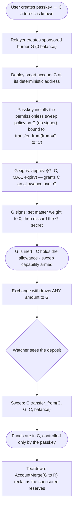
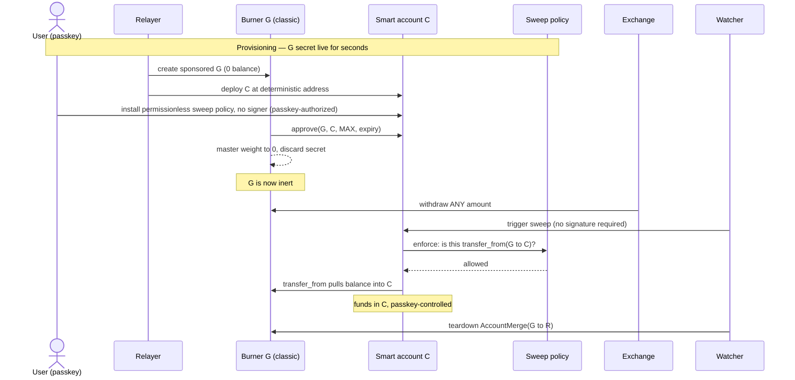
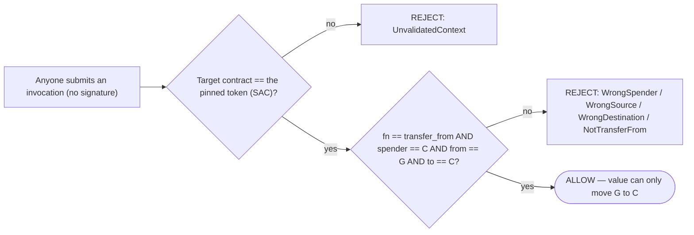
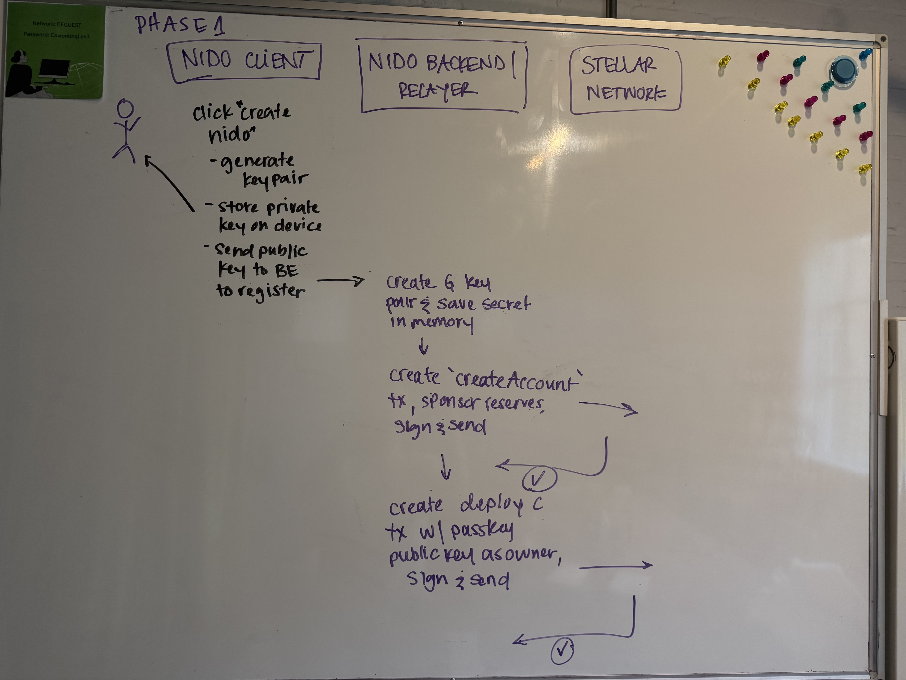
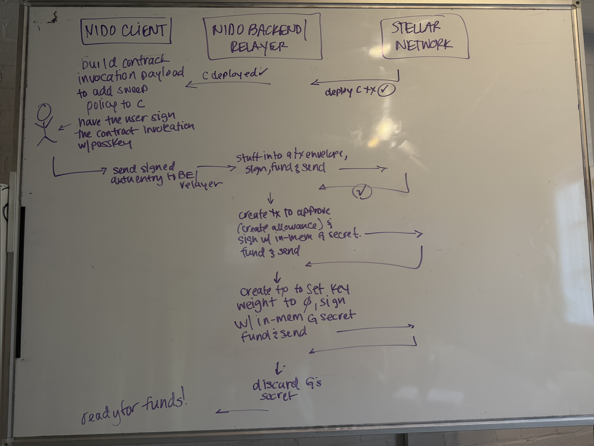

# Onboarding: fund a passkey smart account from a Stellar G-address, non-custodially


## Summary

Let a user end up with funds in a passkey-controlled smart account (**C**, a Soroban contract address) starting from an ordinary Stellar classic account (**G**, the kind an exchange withdraws to), **without any party ever being able to take the funds** and without the user managing a secret key.

The mechanism is an **allowance plus a bounded sweep**:

1. During a short setup step, **C is granted an allowance over G** (`approve`), and G is neutralized so its own key can never spend.
<How is the allowance granted over G? - the `approve` function. How is the amount determined if we don't know how much the user is going to want to send from the exchange?>
<How is G neutralized? Is this via setOptions?>

<initially i was wondering if the contract would not be deployed until the transfer of XLM to G, but now I am realizing that is not the case. G would be created on chain, and C would be deployed before G receives the funds>

<we could use nido-funds as sponsored reserves to create G on chain, and nido-funds for deploying C>
<could the funds be brought back into nido once G is --neutralized-- account merged back to nido?>
 
2. Funds are sent to G — any amount, any number of times.

3. **C pulls the funds into itself** with `transfer_from`. The pull is authorized by the user's passkey, or — for a hands-off flow — **permissionlessly by anyone (typically a watcher)**, because the sweep is provably bounded to "move G's balance into C and nothing else" and so needs no key.

<The sweep is an action that only lets G move funds to C - how is this done? I think via the allowance & transfer_from. How is it provably bound?>

From the moment funds arrive on G they are already effectively C's: they sit under C's allowance and no one but C can move them. The only residual risks are liveness (a sweep may be delayed) and reserve reclaim (the relayer's own money) — never user custody.

## Actors and addresses

| Symbol | What it is |
|---|---|
| **G** | A classic Stellar account — the deposit address an exchange or wallet sends to. |
<Do any exchanges set a user up with an existing G address? this would not work. we would still need a G address that we create in order to control it and neutralize it>

| **C** | The user's passkey smart account (a Soroban contract). Deterministic address, known before deployment. |
<how is the c address known before deployment? also, why does this matter?>
| **R** | The relayer: sponsors reserves and pays fees. Can never spend user funds. |
<is the watcher a smart contract? just another account? - probably an offchain process>
| **watcher** | Submits the permissionless sweep on the user's behalf. Holds no key that can move funds — the passkey or anyone can submit it too. |

## The flow end to end



<user creates passkey, C address is known - how is this known or derived?>

### Phase 1 — Provisioning (G's key is live for a few seconds)

The relayer creates G as a **sponsored account with zero balance** (R covers every reserve, so nothing is stranded later). Then, while G's secret exists in relayer memory only:

- **Deploy C** at its deterministic address (authless; R submits and pays).
- **Install the sweep capability on C** — a context rule carrying the sweep policy with **no signer**, bound to `transfer_from(from = G, to = C)`. Authorized by the user's passkey (the account is its own admin). Being signer-free is what makes the later sweep permissionless.

<sweep capability is a rule (or method on the contract account?) that allows G to transfer to C. This makes sense from C's perspective, but how does G not sign this? G has signed the `approve` transaction and has allowed the allowance for C>

- **G grants the allowance:** `approve(G, C, i128::MAX, expiry)`. Needs no balance; `expiry` is derived from the live network state-archival config (currently ~180 days).
<is what is the approve method on? >*
<this is part of the CAP-46 standard? so its like an erc-20?>*
<ah, its part of this standard, which is presumably built into the SAC? the protocol itself for XLM?
and it works in tandem with transfer_from>


- **G is neutralized:** set master key weight to 0, then discard the secret. G can now do nothing on its own.
<will G stay around forever? is it worth merging it with another address at some point?>
<merging is in phase 4>

### Phase 2 — Funding

The user withdraws from their exchange to G. **Any amount** — there is no pre-committed figure to match, and no memo is required (each G is single-use, so the address alone identifies the deposit). Partial or repeated deposits simply accumulate.
<partial or repeated deposits accumulate - as in multiple G addresses? no, one G address that can receive multiple deposits over time. this could expire - what then?>

### Phase 3 — Sweep

`C.transfer_from(C, G, C, balance)` moves the delivered balance into C. The sweep rule carries no signer, so it is **permissionless** — anyone can submit it, and it can still only move G's balance into C. Two common paths:

- **Passkey sweep:** the user taps their passkey when they return.
- **Hands-off sweep:** a watcher detects the deposit and submits the sweep with **no signature** — no user present, no key to hold. This is what the permissionless policy exists for, and its safety is the subject of the security model below.

<watcher watches for deposits - where/how? like deposits that come from our relayer? indexing all Gs created in nido>>

<once the user sends their funds from the CEX to their G address, does this trigger the sweep? or is all of this done on transfer from CEX? 
my concern is if it is set up before the transfer from the CEX, then what if we have a issue on our server, and the key is lost, since we're only storing it in memory>


Either way the sweep is a normal, retryable transaction, repeatable for any later deposits within the allowance window.

### Phase 4 — Teardown

When the window closes, `AccountMerge(G → R)` reclaims every reserve R sponsored (a pre-signed, bearer transaction R fee-bumps). G is deleted; zero dust remains. A teardown failure only forfeits R's reserve reclaim — it can never touch user funds.

<reclaims every reserve R sponsored  -- cool!>

<i think that once the window closes, then it would be a new g address? is that correct? like what if i have 10xlm and only transfer 5 today, and then another 5 tomorrow>



## Security model

**Claim: no party other than the user's passkey can ever move the user's funds.** This holds through four facts:

1. **A leaked G secret is worthless.** After Phase 1, G's master weight is 0 and its secret is discarded. G can authorize nothing. (For a user-controlled wallet, see Variants — the user keeps their own key, which is theirs anyway.)
2. **Funds are C's the instant they land.** They sit on G under C's allowance; the only account that can move them is C.
3. **The relayer and watcher hold no spending power.** R sponsors and pays fees; it cannot move funds. The watcher only *submits* the sweep — it holds no key, because the sweep needs none.
4. **The sweep is permissionless but bounded to exactly the sweep.** Anyone can invoke it, and it can still only move G's balance into C — so the bound, not a signature, carries the security weight (next section).

### The bounded sweep capability

The permissionless sweep can do **only** `transfer_from(from = the recorded G, to = C)` on the pinned token, and nothing else. Any attempt to redirect funds elsewhere, pull from a different source, spend C's own balance, or call any other function is rejected — no matter who submits it. Since there is no signature gate, the bound is the sole barrier, enforced by two layers an invocation must pass:



- **Layer 1 — contract scope:** the rule is scoped to the single token contract; a call to any other contract is rejected before the policy even runs.
- **Layer 2 — argument check:** a small policy contract reads the `transfer_from` arguments and rejects unless `spender` is C, `from` is the recorded G, and `to` is C.

Because anyone may submit the sweep, these two checks are the entire security perimeter — deliberately so, and validated as such.

This capability is implemented and validated (`PreauthSweepPolicy`, PR #166): the scoping tests run through the real `do_check_auth` path with an **empty signer set** — proving `transfer_from(G → C)` authorizes with zero signatures while every disallowed call rejects with a distinct error code, including a composite test (a diverting context bundled with a valid sweep fails the whole authorization) and a self-source test (C cannot sweep its own funds). Adversarial review: bound airtight, no escape paths.

### Who can do what

| Actor | Can move user funds? | Bounded to | Worst credible failure |
|---|---|---|---|
| Holder of a leaked G secret | **No** | nothing (master weight 0) | learns the G↔C link (disclosure) |
| Relayer R / watcher / anyone | **No** | can only submit the permissionless `transfer_from(G → C)` | stalls the sweep (liveness) — funds stay safe under the allowance |
| Sweep-policy governance admin | **No** | upgrade/rotate the policy | must be a governance key; it holds no ability to move funds |
| The passkey (user) | **Yes** | full control of C | — |

### Preconditions the implementation must guarantee

Because the sweep is permissionless, the argument bound is the sole guarantee — so it must be airtight, and a few properties must hold:

- **The `spender == C`, `from == G`, `to == C`, `fn == transfer_from` checks fail closed on every path** — validated, with no skip or early-return. This is the whole security perimeter, and it is what the audit must scrutinize hardest.
- **The sweep policy's admin is a governance key.** An admin can upgrade the policy; that authority must sit with governance, never exposed to onboarding automation.
- **Set the rule's `valid_until` to the allowance expiry** so a stale sweep rule cannot outlive the window (a provisioning-layer responsibility; the policy does not enforce it).
- **The recorded source G is immutable** once installed (no mutator; changeable only via account-authorized uninstall/reinstall).

### Irreducible trust and bounds

- **G signs twice, once, in a brief live window** (`approve` + neutralize). This is inherent: Stellar classic accounts require the key to authorize any future movement, so the authorization must be set up while the key is live. The relayer holds G's secret only in memory and discards it.
- **The allowance is time-boxed (~180 days).** For the ephemeral flow the secret is gone, so the allowance cannot be renewed; deposits after expiry cannot be claimed. The UX surfaces a countdown and retires the address after teardown.

## Contracts (in scope for the pre-mainnet audit)

This whole flow is new trust surface and must be audited before mainnet. The contract footprint is deliberately tiny:

- **New: `PreauthSweepPolicy`** — a standalone OpenZeppelin `Policy` contract (~120 lines, prototyped and validated). It reads the `transfer_from` arguments in `enforce` and pins `from`/`to`. Independently deployable and upgradable.
- **Unchanged:** the smart-account contract, the factory, the WebAuthn verifier, and the SAC (a protocol contract). The policy plugs into the existing context-rule machinery; **no core-contract changes are required.**

Auditing this alongside the contracts it composes with (one audit, one coherent surface) is the intent — the sweep capability is small and legible, and reviewing it with the account/factory it attaches to is cleaner than a separate later pass.

## Variants (one primitive, three cases)

The same primitive — *C holds an allowance over G, then C pulls* — covers:

- **Exchange / ephemeral burner** (the flow above): the relayer holds G briefly and neutralizes it.
- **One-time transfer:** identical; neutralization optional.
- **User-controlled wallet:** the user's own wallet holds G and signs `approve` (as the transaction source, so any standard wallet works); G is **not** neutralized — it stays the user's account, optionally kept as a recovery signer on C. The user pulls with their passkey (the permissionless sweep policy is only needed for the hands-off ephemeral flow).

## Forward compatibility: CAP-0072

[CAP-0072](https://github.com/stellar/stellar-protocol/blob/master/core/cap-0072.md) ("Contract signers for Stellar accounts", currently Draft) adds a delegated-signer type that lets a classic G-account delegate its authentication to a smart contract's `__check_auth`. When it lands, **G no longer needs to be ephemeral**: set G's master weight to 0 and add a delegated signer = C, and the passkey controls G directly. Moving funds becomes a direct passkey-authorized `transfer(G → C)` — no allowance, no `transfer_from`, no neutralize-and-discard, no 180-day expiry, no per-onboarding teardown. G becomes a persistent, reusable deposit address, and the security model gets cleaner (G is controlled by the same passkey as C).

We are **not** building on it yet (Draft; not on testnet/mainnet). But because it will obsolete the allowance / neutralization / teardown machinery, this design should:

- **Keep a stable seam.** The onboarding interface — "user gets a deposit address G; funds land in C, non-custodially" — is invariant. The funding-source mechanism (allowance + bounded sweep now; delegated signer later) sits behind it as a swappable module.
- **Not over-invest in the ephemeral machinery.** Build the minimum that works on today's protocol.
- **Keep the bounded-sweep policy.** The scoped hands-off sweep is useful in both worlds; its predicate adapts from `transfer_from` to the delegated `transfer(G → C)`.

Migration caveats: exchanges still withdraw to classic G-addresses (G stays the landing zone); a one-time G-key signature is still needed to install the delegated signer; delegated signers cannot authorize classic operations (closing G later routes through the G-account contract to re-add a key, then merge — or G is left open); and per CAP-0072 the delegated signer's base reserve cannot be sponsored, so a persistent G is an ongoing per-user reserve cost rather than reclaimed at teardown.

## Validation status

- **Sweep capability bound** — implemented and validated (`PreauthSweepPolicy`, PR #166): permissionless (zero-signer) authorization proven on the real `do_check_auth` path; `spender == C` hardening added; composite + self-source attack tests pass; adversarial review found no escape. Remaining: wire the rule's `valid_until` to the allowance expiry, and an on-chain testnet run.
- **Account neutralization + allowance mechanics** — validated on testnet (sponsored 0-balance G, `approve` before funding, `transfer_from` after neutralization, zero-dust teardown).
- **Wiring invariants** — must be enforced and tested at the provisioning layer (not expressible in a contract unit test).

## Milestones

1. **Sweep policy** — ✅ done (PR #166): permissionless `PreauthSweepPolicy` with the `spender == C` hardening and full unit + integration coverage (real `do_check_auth`, zero signers), in the audited contract set. Remaining sub-item: wire the rule's `valid_until` to the allowance expiry.
2. **On-chain validation** — deploy the policy to testnet, wire it onto a factory-deployed C, drive one real permissionless sweep from a neutralized, sponsored G.
3. **Relayer provisioning endpoint** — create sponsored G; deploy C; install the sweep rule; `approve`; neutralize; discard secret; persist state; fee-bump submissions. Enforces the wiring invariants.
4. **Deposit watcher** — detect the deposit on G (Horizon), trigger the bounded sweep, schedule teardown. Holds no key that can move funds anywhere but into C.
5. **Onboarding UX** — passkey creation, deposit address + "send any amount", pending-deposit claim, allowance-expiry countdown, retired-address messaging.
6. **Teardown + reserve reclaim** — scheduled `AccountMerge(G → R)`; bearer escrow of the teardown transaction so reclaim never depends solely on Nido.
7. **Non-XLM** — per-token allowance + sweep (one sweep rule per token) and a sponsored trustline on G. The policy is already per-token scoped.
8. **Docs + tests** — the security model above, the wiring invariants as enforced checks, and the negative-case scoping tests as an automated lane.

## Acceptance criteria

- [ ] `PreauthSweepPolicy` hardened (`spender == C`, rule expiry) with unit + integration tests, in the audit scope.
- [ ] On-chain hands-off sweep demonstrated on testnet end to end.
- [ ] Provisioning endpoint that installs the signer-free sweep rule with `valid_until` = the allowance expiry, keeps the policy admin a governance key, and never persists G's secret.
- [ ] Watcher that triggers the bounded sweep and cannot move funds outside C.
- [ ] UX for any-amount funding, pending-deposit claim, and expiry.
- [ ] Scheduled teardown with bearer escrow; zero dust.
- [ ] Security model documented; wiring invariants enforced in code; scoping negative-cases in CI.

----------------------------------------
# EE Notes

## Additional topics to research
- bounded sweep
- SEP-41: approve, allowance, transfer_from ✅
- CAP-0072 ✅
- passkeys / webauthn ✅
- how is c address derived
- c address can't sign transaction envelopes? why is this bad? because they can't sign their own transactions & pay their own feeds, so a relayer or sponsor of sorts is required. ✅ 

## SEP-41 Token Interface
* `allowance`: retrieve the allowance for a specific spender
```
/// Returns the allowance for `spender` to transfer from `from`.
///
/// The amount returned is the amount that spender is allowed to transfer
/// out of from's balance. When the spender transfers amounts, the allowance
/// will be reduced by the amount transferred.
///
/// # Arguments
///
/// * `from` - The address holding the balance of tokens to be drawn from.
/// * `spender` - The address spending the tokens held by `from`.
fn allowance(env: Env, from: Address, spender: Address) -> i128;
```

* `transfer_from`: does the transfer for a spender if they have an allowance
```
/// Transfer `amount` from `from` to `to`, consuming the allowance that
/// `spender` has on `from`'s balance. Authorized by spender
/// (`spender.require_auth()`).
///
/// The spender will be allowed to transfer the amount from from's balance
/// if the amount is less than or equal to the allowance that the spender
/// has on the from's balance. The spender's allowance on from's balance
/// will be reduced by the amount.
///
/// # Arguments
///
/// * `spender` - The address authorizing the transfer, and having its
///   allowance consumed during the transfer.
/// * `from` - The address holding the balance of tokens which will be
///   withdrawn from.
/// * `to` - The address which will receive the transferred tokens.
/// * `amount` - The amount of tokens to be transferred.
///
/// # Events
///
/// Emits an event with topics `["transfer", from: Address, to: Address],
/// data = amount: i128`
fn transfer_from(env: Env, spender: Address, from: Address, to: Address, amount: i128);

```

- approve: creates an allowance of a specific amount for a specific spender
```
/// Set the allowance by `amount` for `spender` to transfer/burn from
/// `from`.
///
/// The amount set is the amount that spender is approved to transfer out of
/// from's balance. The spender will be allowed to transfer amounts, and
/// when an amount is transferred the allowance will be reduced by the
/// amount transferred.
///
/// # Arguments
///
/// * `from` - The address holding the balance of tokens to be drawn from.
/// * `spender` - The address being authorized to spend the tokens held by
///   `from`.
/// * `amount` - The tokens to be made available to `spender`.
/// * `live_until_ledger` - The ledger number where this allowance expires. Cannot
///    be less than the current ledger number unless the amount is being set to 0.
///    An expired entry (where live_until_ledger < the current ledger number)
///    should be treated as a 0 amount allowance.
///
/// # Events
///
/// Emits an event with topics `["approve", from: Address,
/// spender: Address], data = [amount: i128, live_until_ledger: u32]`
fn approve(env: Env, from: Address, spender: Address, amount: i128, live_until_ledger: u32);

```

> If you want to make a payment of a Stellar asset between a Stellar account and a contract address, or between two contract addresses, then the asset's contract must be used. Stellar's payment-related operations cannot have contract addresses as their source or destination.
https://developers.stellar.org/docs/build/guides/transactions/send-and-receive-payments

> If a sender is using a Contract Account, and sending an SAC token (such as XLM, USDC, etc.), the transaction will be received by the G account normally since it is supported on a protocol level.
https://developers.stellar.org/docs/build/guides/transactions/send-and-receive-c-accounts


## CAP-0072
- g addresses have access to more of the ecosystem than c addresses
- but c accounts allow for customization in auth, like passkeys
- however, as it currently stands, to do this would mean giving up a lot of the functionality that g-accounts off <what functionality specificially?>
- this cap is hoping to bridge the gap between c and g accounts, and reducing the complexity of it by: creating new G account signers that are only useable within a smart contract - **delgated signers**
- it will not allow c accounts pay fees

- delegated signers - can't sign the tx directly, but can sign a soroban auth entry
- so this is about being able to sign the inner transaction from a g address

- a delegated signer can be a contract <but a contract is a c address i think im missing something here>
    - i think it is that if the delegated signer is a c address, it will call __check_auth auth of the source maybe thats calling the tx?

- if the delegated signer is a g account, the __check_auth that already exists just does its thing

- delegated signers can only be used for auth in the smart contract env - this is required so that customizable auth can be used
<need to understand how passkeys fit in with a contract account a bit more to fully get this>
- the g address (is it every g address? just ones that are delegated signers?) will be treated as a built-in smart contract <how? - ah, kind of like the SAC wraps a smart contract, maybe a contract will wrap any delegated signers? a DSC? delegated signer contract > that allows for account management like recovery
- yes, i think its like the SAC, except every account will be automaticaly instantied as a contract <this is interesting... like is this contract the smart account?>
- there are sponsorship implications - need to read more about that

stellar G accoutn contract interface
- this introduces a callable smart contract interface for Stellar Accounts
<so this kind of adds an interface for smart accounts>
- add/remove ed25519 signer - would this end up being the "primary signer"? like what is the relationship between this signer and the delegated signer?
and since this is a contract, it wont be able to sign soroban txn based on the original issue this is trying solve? so why have an ed25519 signer? i think this is the master key - but still dont fully understand how / where it would be used

ah "The 'master' key is the public ed25519 key that identifies the account itself. Setting the weight to 0 effectively removes the master key from the account."

but why would you want to do that?

- delegated signers get __check_auth instead of sig validation 
<i think this meanst aht delegated signers get the built in __check_auth called on instead of the normal auth entry sig check?>

Classic txs
- new delegated signer is added, its a g address
- will be supported in most places that expect a signer
- not supported in extraSigners tx precondition - delegated signers ignored during the tx signature verification <this part is fuzzy>

Smart contract txns
- G account ath
- algo for verifying detached (non source account) smart contract auth is updated to include delegated accoutn support
<is this the signing of auth entries?>

- g-accoutn contract GAC
- every g account on chain gets an instance  - when a contract call is performed on a g address the GAC built into the host will handle it - similar to SAC

<will every g account need to be a GAC?>

**<did not fully read the `AccountEntry` piece - go back to that>**


## FIDO Alliance Passkeys
- https://fidoalliance.org/passkeys/
- passkeys are password replacement technology
- password - something that can be remembered and typed
- passkey - a secret stored on one's devices, unlocked by the user via biometrics, security key, etc
- passkeys better than password + 2fa because both of these are still phishable
- provider - responsible for creation & management of passkeys -> could be iCloud keychain for example
- FIDO = **Fast Identity Online**
    - an open standard
    - phone (or other device) creates a key pair
    - the private key stays on device
    - the public key registers with the app 
- FIDO2 is WebAuthn + CTAP
    - WebAuthn is the browser API part, i think WebAuthn itself is the definition for public key-based credentials in web apps - doesnt necessarily need to be passkeys

## Webauthn
- https://www.webauthn.me/passkeys
- phishing-resistant passwordless approach to authentication - because passkeys don't rely on a shared secret 
- entities:
    - user
    - user agent
    - authenticator
    - relying party

- passkeys use the same infra as webauthn - webauthn is for public key auth from a browser, passkeys use this + other stuff to be passkeys
    - it provides the interface to create & manage passkeys
- CTAP - client to authenticator protocol
    - how a user's client device communicates locally with an external authenticator
    - this comes into play for external security keys (not the deivce that the browser is running on, so this doesn't apply to phones necessarily?)

- two types of passkeys:
    - device-bound: single-device, private keys cant's leave the device, typically for sercurity keys
    - synced: multi-device, iCloud, etc

- passkeys vs webauth:
    - passkeys are the credentials that auth users 
    - webauthn is the spec that allows devs to implement passkey support in web apps

## My summary
This is a proposal to allow onboarding from an exchange (for example, but could be another G-address) to a C account.

What problems in this solving?
Allowing a user from an Exchange to send funds to a G address, and then behind the scenes it will create a funded contract account for them. 

Currently, Nido gets around the fact that a C-address cannot sign it's own transactions by using a central G address to handle the account creation and contract deployment. This proposal moves that responsibility to a ephemeral G address.

1. set up step:
    * create G** (with sponsored reserves? can we get these back after we accountMerge G?)
    * determine the address of C - does this get deployed now? why do we need the address head of time?
    * grant the allowance of C over G - can this be done before C is deployed?
    * neutralize G - set options to make g's key weight 0
2. sending funds from CEX - this happens outside of nido, by the user in the CEX
3. C pulls the funds into itself with `transfer_from` - this will be a Policy that we create and is the bounded sweep. I _think_ that either the user can kick this off and use their pass key. OR, a watcher can kick this off without a key, since the sweep is set up such that it only works for funds from G to C

## EE Diagrams

### phase 1



outstanding questions:
- is the relayer conceptually part of the backend service? if so, we should make sure to write it so that its easy to remove/section off later once CAP-72 is a think
- does the relayer create the transactions? yes, the relayer is creating & submitting the txns, but not necessarily always the one to authorize them
- based on the one diagram it is unclear if the tx to create the sweep policy on C goes through the relayer. it says it should be signed with the passkey - but does this mean that the sweep will be signed by the passkey, not the creating the policy tx?
    - C's auth is the passkey, and it will need to auth the addition of a policy
    - the client builds the tx contract call payload and signs it and passes it to the relayer
    - but then the relayer is what sends & pays for the tx - this is kind of the whole point, c can't do this on it's own